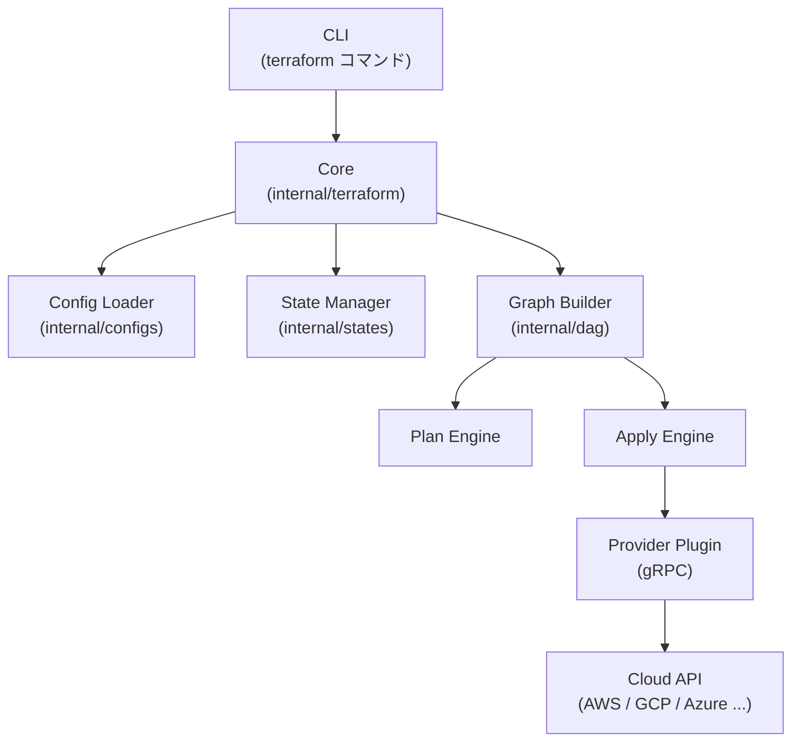
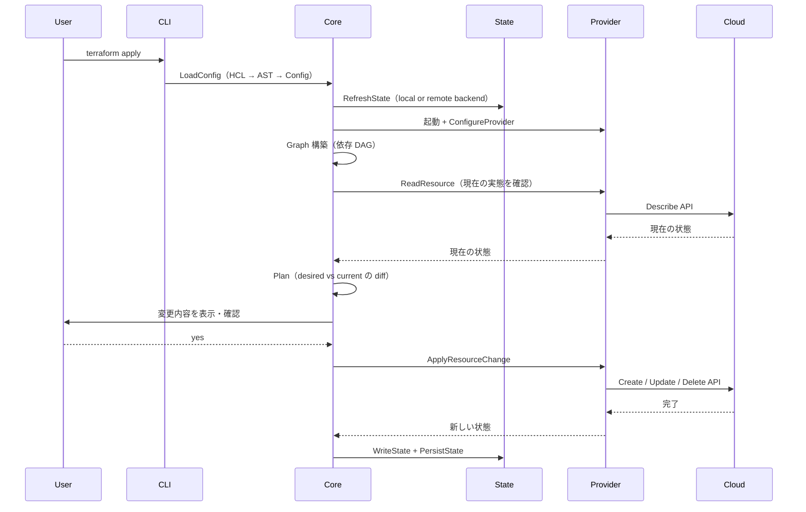

# Terraform Core アーキテクチャ全体像

## なぜ Terraform はこのアーキテクチャを選んだのか？

Terraform の設計思想は **「宣言的 IaC」** にある。
ユーザーは「どう作るか」ではなく「何があるべきか」を書き、
Terraform が差分を計算して必要な操作だけを実行する。

この思想を実現するために選んだ設計上の決断が3つある。

| 設計判断 | 理由 |
|---------|------|
| **State ファイルで現在状態を管理** | クラウド API は全リソースの一覧取得が遅い・不完全なため、ローカルキャッシュとして State を持つ |
| **Provider を別プロセス（gRPC）に分離** | クラウドごとの差分を Core から完全に隔離し、独立リリース・クラッシュ隔離を実現する |
| **依存グラフ（DAG）で並列実行** | リソース数が増えても依存関係のないものを並列実行することでスケールさせる |

---

## 主要コンポーネント

---

## terraform apply の内部フロー

---

## 4つの主要概念

| 概念 | 役割 | なぜ必要か |
|------|------|-----------|
| **Provider** | クラウド API のラッパー（gRPC プラグイン） | クラウドごとの差分を Core から隔離するため |
| **Resource** | 管理対象のインフラ単位（EC2, S3 等） | 宣言の最小単位として CRUD を抽象化するため |
| **State** | 現在のインフラ状態を記録する JSON | API の全量取得コストを避け、差分計算を高速化するため |
| **Module** | 再利用可能な設定のまとまり | DRY 原則を実現し、環境差分をパラメータで吸収するため |

---

## 内部パッケージ構成（Go）

| パッケージ | 内容 |
|-----------|------|
| `internal/command` | CLI サブコマンド実装 |
| `internal/configs` | HCL 設定パーサー |
| `internal/states` | State 型定義・操作 |
| `internal/plans` | Plan 型定義・シリアライズ |
| `internal/providers` | Provider インターフェース |
| `internal/backend` | Backend インターフェース |
| `internal/addrs` | リソースアドレス型（`aws_instance.web` 等） |
| `internal/lang` | 式評価・組み込み関数 |
| `internal/dag` | 依存グラフ（DAG）実装 |
| `internal/terraform` | Graph ノード・Walk の主要ロジック |

---

## 運用・障害の観点

| シナリオ | 症状 | 対処 |
|---------|------|------|
| State の破損 | `Error: Invalid JSON` や `panic` | `terraform state pull` で取得し、JSON を手動修復 |
| State ロックが残る | `Error acquiring the state lock` | 前回 Apply の異常終了。`terraform force-unlock` で解除 |
| Provider クラッシュ | `Plugin did not respond` | Provider バイナリの再インストール。`TF_LOG=DEBUG` で原因調査 |
| Graph のサイクル | `Error: Cycle` | `depends_on` の循環参照。`terraform graph` で可視化して特定 |
| State ドリフト | Plan で予期しない変更が出る | 手動変更が加わっている。`terraform refresh` で State を実態に合わせる |

> **監視指標**: Apply の実行時間が突然増加した場合は、Provider の API レイテンシ増加（クラウド側の問題）か、リソース数の増大による Graph Walk の遅延かを切り分ける。`TF_LOG=DEBUG` のタイムスタンプが判断の起点になる。

---

## 詳細ドキュメント

- `provider.md` — Provider プラグインの gRPC プロトコルと設計意図
- `state.md` — tfstate 構造・remote backend・locking
- `plan-apply.md` — Plan/Apply の内部フロー
- `graph.md` — DAG walk アルゴリズム・並列実行・サイクル検出
- `modules.md` — モジュールシステム
- `expressions.md` — HCL 式評価・for_each・depends_on
- `backends.md` — S3/GCS/Consul バックエンド
- `lifecycle.md` — create_before_destroy・precondition/postcondition
- `cli.md` — CLI コマンド構造
- `glossary.md` — 内部型・概念一覧
