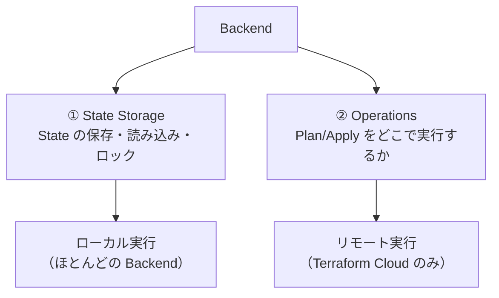
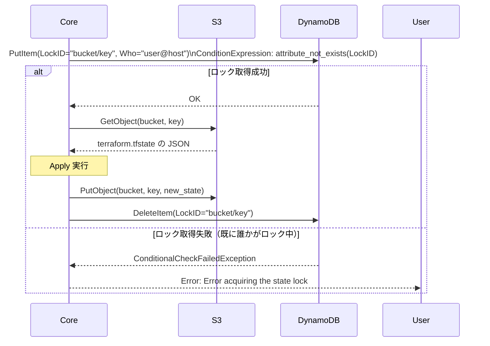
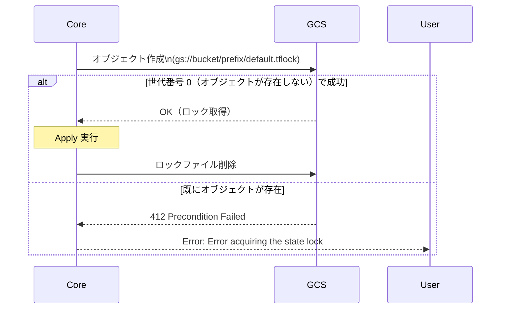
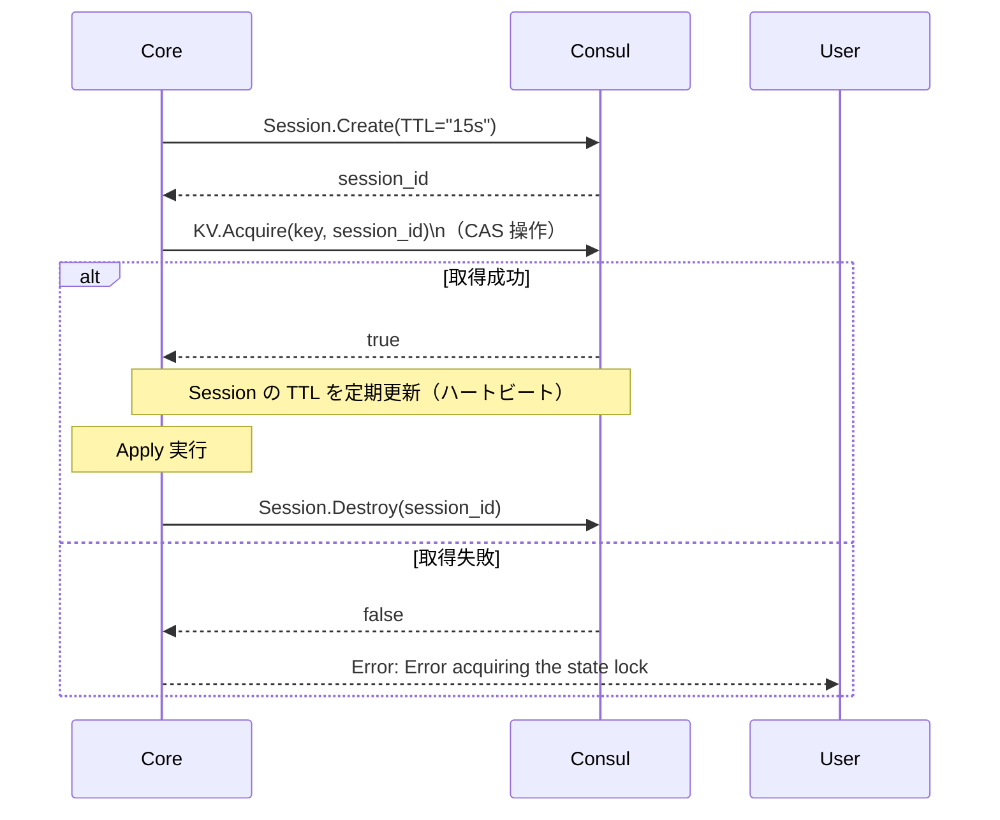
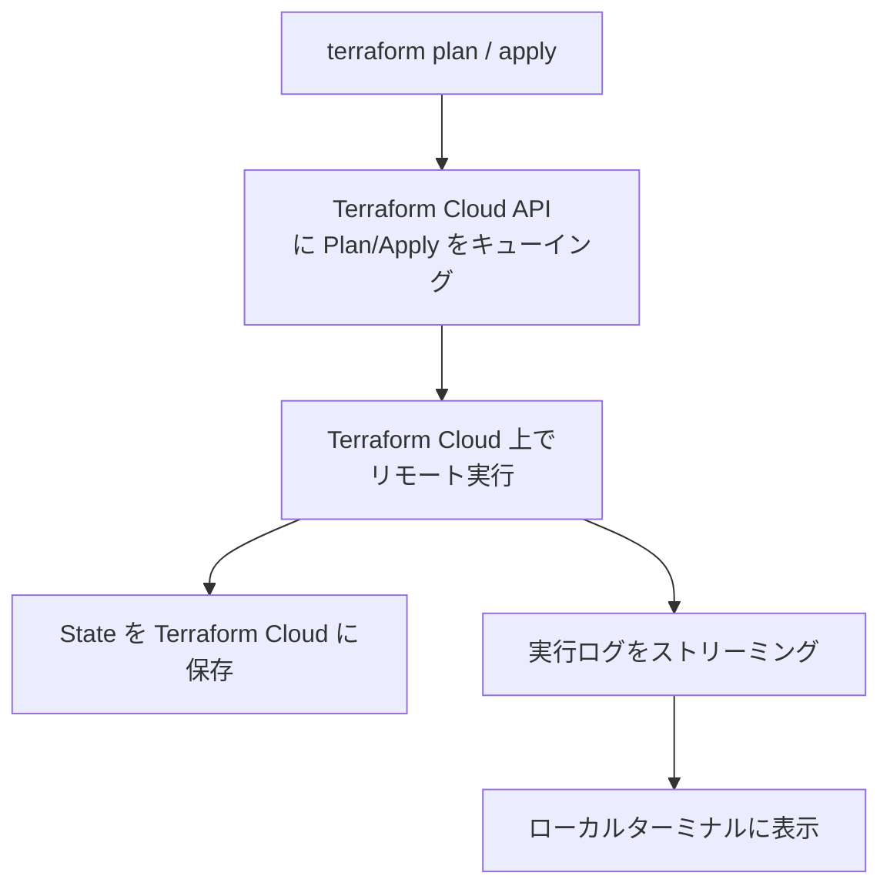
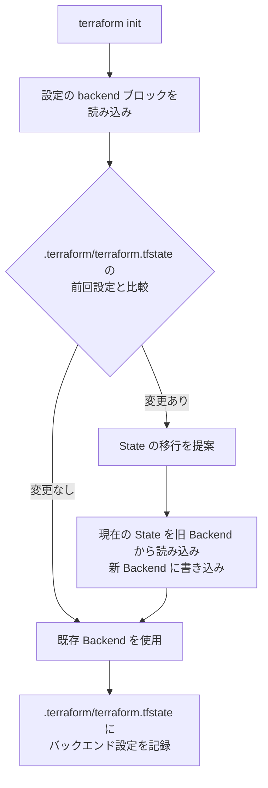

# バックエンド設定（S3/GCS/Consul の仕組み）

## なぜ Remote Backend が必要なのか？

デフォルトのローカル State（`terraform.tfstate`）には根本的な問題がある。

| 問題 | 説明 |
|-----|------|
| **チーム共有できない** | ローカルファイルは git にコミットしにくい（機密値が含まれるため） |
| **同時実行できない** | 複数人が同時に apply すると State が壊れる |
| **CI/CD に載せにくい** | CI のエフェメラルな実行環境に State が残らない |

Remote Backend はこれらをすべて解決する。

> **State を git に入れてはいけない理由**: State には `sensitive = true` の値も平文で記録される。RDS のマスターパスワード、TLS 秘密鍵などが含まれることがあり、git 履歴に残ると取り返しがつかない。

---

## バックエンドの2つの役割



---

## S3 バックエンドの内部動作

```hcl
terraform {
  backend "s3" {
    bucket         = "my-terraform-state"
    key            = "environments/prod/terraform.tfstate"
    region         = "ap-northeast-1"
    dynamodb_table = "terraform-state-lock"
    encrypt        = true
    kms_key_id     = "arn:aws:kms:..."
  }
}
```



**なぜ DynamoDB を使うのか？**

S3 はオブジェクトの条件付き書き込みが弱い（S3 の条件付きリクエストは 2024 年に追加されたが普及途上）。
DynamoDB の `ConditionExpression` は原子的な比較・書き込みを保証するため、分散ロックの実装に適している。

---

## GCS バックエンドのロック機構



`x-goog-if-generation-match: 0` ヘッダーにより、
オブジェクトが存在しない場合のみ作成を許可する楽観的ロックを実装している。

---

## Consul バックエンドのロック機構

```hcl
terraform {
  backend "consul" {
    address      = "consul.example.com:8500"
    path         = "terraform/myapp/prod"
    access_token = var.consul_token
    lock         = true
  }
}
```



Consul Session の TTL による自動解放:
Core がクラッシュしてもセッションが TTL 切れになればロックが自動解放される。

---

## Terraform Cloud バックエンド（推奨）

```hcl
terraform {
  cloud {
    organization = "my-org"
    workspaces {
      name = "my-workspace"
    }
  }
}
```



**Terraform Cloud が推奨される理由:**

- API レベルのロックで最も堅牢
- 実行ログの永続化・監査ログ
- Plan の UI レビュー・承認フロー
- State の暗号化・バージョン履歴

---

## バックエンド初期化フロー



---

## 運用・障害の観点

| シナリオ | 症状 | 対処 |
|---------|------|------|
| DynamoDB テーブルが存在しない | `NoSuchTable` エラー | DynamoDB テーブルを事前に作成。または Terraform で管理する |
| S3 バケットが存在しない | `NoSuchBucket` | backend 設定より先にバケットを作成する（bootstrap 問題） |
| ロックが残る | `Error acquiring the state lock` | `terraform force-unlock <LOCK_ID>` |
| backend 変更後の State 移行失敗 | State が壊れる | 変更前にバックアップ（`terraform state pull > backup.tfstate`） |
| CI での Provider インストール失敗 | `registry.terraform.io` に届かない | プロキシ設定または `HTTPS_PROXY` 環境変数を確認 |

> **監視指標**: S3 + DynamoDB 構成では、DynamoDB の `ConditionalCheckFailedRequests` メトリクスを CloudWatch で監視する。増加傾向があれば Apply の同時実行が増えているサインで、チームのワークフロー見直しが必要。

---

## 関連パッケージ

| パッケージ | 内容 |
|-----------|------|
| `internal/backend` | Backend インターフェース定義 |
| `internal/backend/local` | ローカルバックエンド（デフォルト） |
| `internal/backend/remote` | Terraform Cloud バックエンド |
| `internal/backend/init` | バックエンド初期化・登録マップ |
| `internal/cloud` | Terraform Cloud API クライアント |
