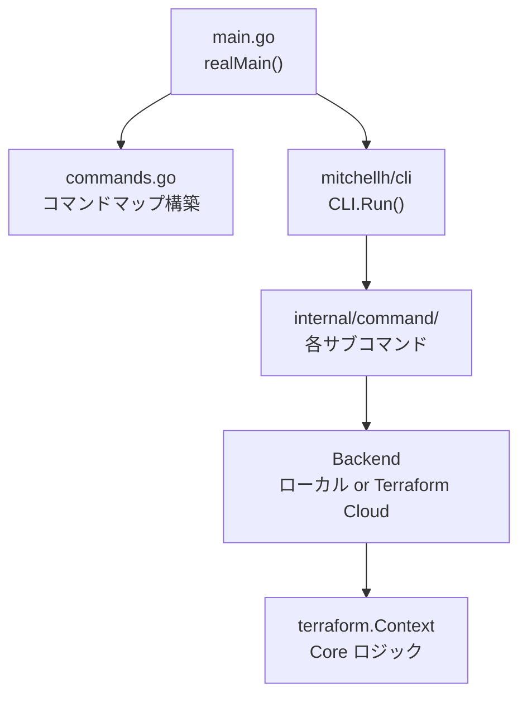
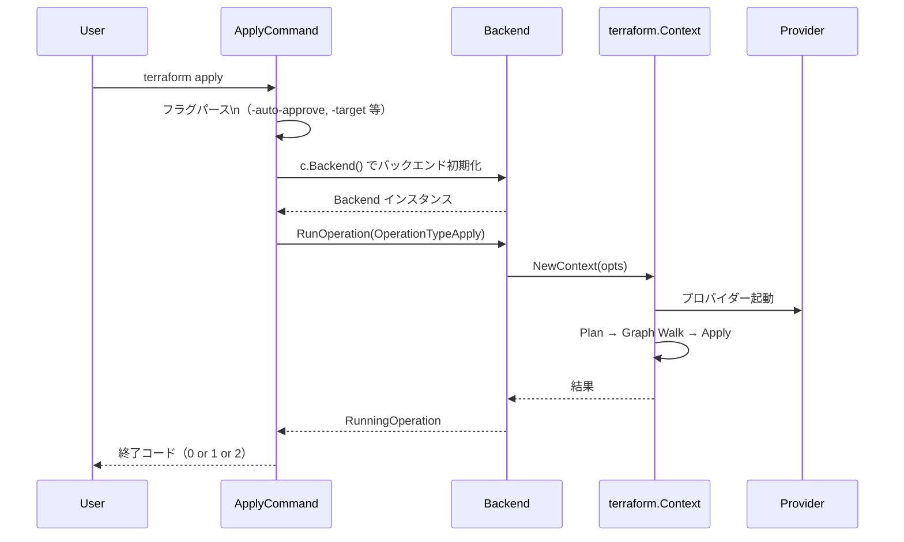
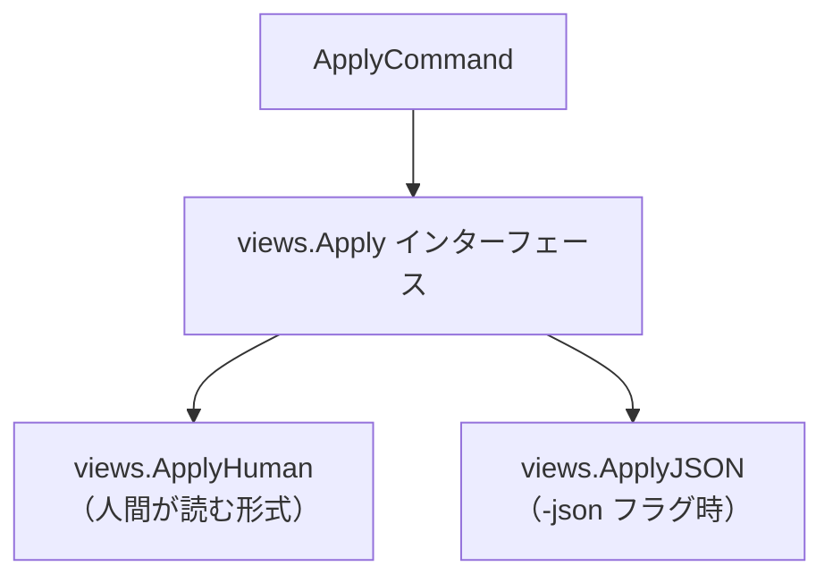

# CLI コマンド構造（internal/command の登録・実行・UI フロー）

## なぜ CLI の構造を理解する必要があるのか？

Terraform を深く使うと「なぜこのオプションが効かないのか」「なぜこの順序で処理されるのか」という疑問が生まれる。
CLI の構造を理解することで、エラーメッセージの読み方・デバッグの起点・カスタム自動化の設計ができるようになる。

---

## エントリーポイント



---

## コマンド登録マップ

```go
// commands.go
var Commands map[string]cli.CommandFactory = map[string]cli.CommandFactory{
    "apply": func() (cli.Command, error) {
        return &command.ApplyCommand{Meta: meta}, nil
    },
    "plan": func() (cli.Command, error) {
        return &command.PlanCommand{Meta: meta}, nil
    },
    "init": func() (cli.Command, error) {
        return &command.InitCommand{Meta: meta}, nil
    },
    // ...
}
```

**なぜ `CommandFactory`（関数）を使うのか？**

コマンドを即時インスタンス化せず、実行時に生成することで、
使用されないコマンドのメモリ割り当てを避けている。
また、各コマンドが独立した状態を持てる。

---

## Meta 構造体（全コマンド共通の状態）

```go
// internal/command/meta.go
type Meta struct {
    Ui         cli.Ui          // 入出力インターフェース
    color       bool
    noColor     bool
    input       bool           // インタラクティブ入力の有無
    WorkingDir  *workdir.Dir   // 作業ディレクトリ
    ContextOpts *terraform.ContextOpts
}
```

`Meta` を全コマンドが埋め込むことで、UI・ワーキングディレクトリ・オプションを共有している。

---

## apply コマンドの実行フロー



---

## UI と Views の分離

Terraform 1.0 以降、出力フォーマットは `views` パッケージで管理される。



**なぜ Human と JSON を分けるのか？**

CI パイプラインやモニタリングツールは JSON を parseしやすい。
人間はカラー付きのテキストを読みやすい。
インターフェースで抽象化することで、コマンドのロジックを変えずに出力形式を切り替えられる。

```bash
terraform apply -json 2>&1 | jq '.changes.add'
```

---

## ワーキングディレクトリの管理

```
.terraform/
├── terraform.tfstate       # バックエンド設定（≠ リソースの State）
├── providers/              # Provider バイナリキャッシュ
│   └── registry.terraform.io/hashicorp/aws/5.0.0/linux_amd64/
│       └── terraform-provider-aws_v5.0.0
└── modules/                # Module ダウンロードキャッシュ
    ├── modules.json        # モジュールマニフェスト
    └── network/            # ダウンロード済みモジュール
.terraform.lock.hcl         # Provider バージョンロック
```

**`.terraform/` を git に入れてはいけない理由:**
バイナリ（Provider プラグイン）が含まれるため容量が大きい。
かつプラットフォーム（linux/darwin/windows）依存のバイナリなので、環境間で共有できない。

---

## 主要コマンド一覧

| コマンド | 実装ファイル | 主な処理 |
|---------|------------|---------|
| `init` | `command/init.go` | Backend・Provider・Module の初期化 |
| `plan` | `command/plan.go` | Plan 実行・planfile 出力 |
| `apply` | `command/apply.go` | Apply 実行（Plan 含む） |
| `destroy` | `command/apply.go` | `-destroy` フラグ付き apply |
| `validate` | `command/validate.go` | 設定の静的検証 |
| `state` | `command/state*.go` | State 操作サブコマンド群 |
| `import` | `command/import.go` | 既存リソースの import |
| `output` | `command/output.go` | Output 値の表示 |
| `show` | `command/show.go` | State/planfile の表示 |
| `graph` | `command/graph.go` | 依存グラフの DOT 形式出力 |
| `fmt` | `command/fmt.go` | HCL フォーマット |
| `test` | `command/test.go` | `terraform test` 実行（1.6+） |

---

## 終了コードと CI での使い方

| コード | 意味 |
|--------|------|
| `0` | 成功（または変更なし） |
| `1` | エラー |
| `2` | `plan -detailed-exitcode` で変更あり |

```bash
# CI でのパターン
terraform plan -detailed-exitcode
EXIT_CODE=$?

if [ $EXIT_CODE -eq 1 ]; then
  echo "Plan エラー"
  exit 1
elif [ $EXIT_CODE -eq 2 ]; then
  echo "変更あり: PR にコメント or 手動承認フローへ"
fi
```

---

## 環境変数によるデバッグ

| 環境変数 | 効果 |
|---------|------|
| `TF_LOG=DEBUG` | 詳細ログを stderr に出力 |
| `TF_LOG=TRACE` | gRPC の通信内容まで出力（非常に詳細） |
| `TF_LOG_PATH=/tmp/tf.log` | ログをファイルに出力 |
| `TF_INPUT=false` | インタラクティブ入力を無効化（CI 向け） |
| `TF_CLI_ARGS_plan="-no-color"` | サブコマンドにデフォルト引数を追加 |
| `CHECKPOINT_DISABLE=1` | バージョンチェックを無効化 |

---

## 運用・障害の観点

| シナリオ | 症状 | 対処 |
|---------|------|------|
| `init` が毎回遅い | Provider ダウンロードに時間がかかる | CI で `.terraform/` をキャッシュする |
| CI でインタラクティブ入力を求められる | `terraform apply` がハングする | `TF_INPUT=false` または `-auto-approve` を設定 |
| Provider ハッシュ不一致 | `registry.terraform.io ... hash mismatch` | `terraform providers lock -platform=linux_amd64` で CI 用ハッシュを追加 |
| JSON 出力が途切れる | `-json` フラグで不完全な JSON が出る | stderr と stdout が混在している。`2>/dev/null` で分離 |

> **監視指標**: CI での `terraform plan` の実行時間をトラッキングする。増加傾向があれば Provider の `ReadResource`（refresh）が遅い、またはリソース数の増大が原因。`-refresh=false` で refresh をスキップして Plan 速度を改善できるが、State ドリフトを検出できなくなるトレードオフがある。

---

## 関連パッケージ

| パッケージ | 内容 |
|-----------|------|
| `internal/command` | 全 CLI コマンド実装 |
| `internal/command/views` | 出力フォーマット（Human/JSON） |
| `internal/command/arguments` | フラグパース用引数型 |
| `internal/command/workdir` | ワーキングディレクトリ管理 |
| `internal/backend/local` | ローカル Operation 実行 |
| `github.com/mitchellh/cli` | CLI フレームワーク |
