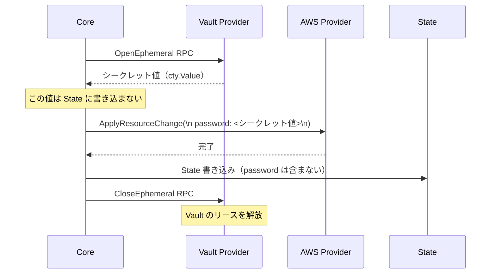
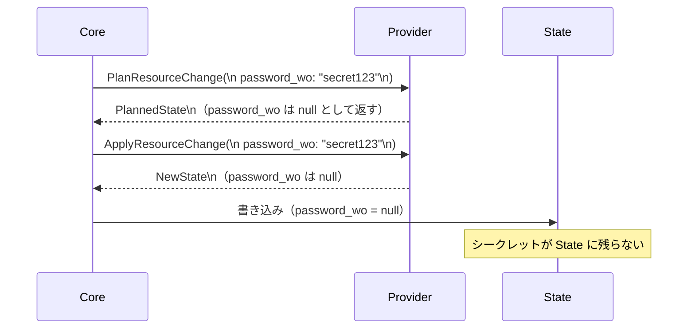

# Ephemeral Values（一時値・write-only 属性）

## なぜ Ephemeral Values が必要なのか？

Terraform の State には `sensitive = true` の値も **平文で保存される**。
これはセキュリティ上の根本的な問題だった。

例：
- データベースのパスワードを `aws_db_instance.password` で設定すると State に平文で残る
- Vault から取得したシークレットも State に書き込まれてしまう

Ephemeral Values（1.10+）はこの問題を解決する。
**State に一切保存されない値** を扱う仕組みを提供する。

| 種別 | State への保存 | 導入バージョン |
|-----|-------------|-------------|
| 通常の値 | される | — |
| `sensitive = true` | される（マスク表示のみ） | 0.14 |
| Ephemeral Values | **されない** | 1.10 |

---

## Ephemeral Resource（一時リソース）

```hcl
# Vault からシークレットを取得（State に保存されない）
ephemeral "vault_kv_secret_v2" "db_password" {
  mount = "secret"
  name  = "database/password"
}

resource "aws_db_instance" "main" {
  username = "admin"
  password = ephemeral.vault_kv_secret_v2.db_password.data["password"]
  # ↑ この値は State に保存されない
}
```



**重要:** Ephemeral Resource は `plan/apply` のたびに毎回取得される（State に保存しないため）。

---

## write-only 属性

Provider 側で `WriteOnly: true` を宣言した属性は State に保存されない。

```hcl
resource "aws_db_instance" "main" {
  username           = "admin"
  password_wo        = var.db_password  # write-only 属性
  password_wo_version = 1               # 変更のトリガー用バージョン番号
}
```



**write-only の変更検出:**

write-only 属性自体は State に保存されないため、値が変わっても差分を検出できない。
`password_wo_version` のような「バージョン番号」属性を併用し、
バージョンを上げることで意図的に変更をトリガーする。

---

## Ephemeral 変数（変数の ephemeral フラグ）

```hcl
variable "db_password" {
  type      = string
  sensitive = true
  ephemeral = true  # State に保存しない
}
```

`ephemeral = true` の変数は、write-only 属性や ephemeral resource にのみ渡せる。
通常の resource 属性に渡そうとするとエラーになる。

---

## Ephemeral Output

```hcl
output "connection_string" {
  value     = "postgres://admin:${var.db_password}@${aws_db_instance.main.endpoint}"
  ephemeral = true  # この output は State に保存されない
}
```

Ephemeral output は他のモジュールから参照できるが、
`terraform output` コマンドでは表示されない。

---

## cty レベルでの実装

```go
// Ephemeral Values は cty の "marks" 機能で実装されている
// 値に "ephemeral" マークを付けることで State への書き込み時に除外する

// internal/lang/marks/marks.go
var Ephemeral = marks.New("ephemeral")

// State 書き込み時に ephemeral マークの値を null に置き換える
// internal/states/statefile.go
```

**marks とは？**

`cty.Value` にメタデータ（マーク）を付与する機能。
`sensitive` マークと同じ仕組みで実装されており、
値の伝播時にマークが引き継がれる。

---

## Ephemeral と sensitive の違い

| 特性 | sensitive | ephemeral |
|-----|----------|-----------|
| State への保存 | される（平文） | されない |
| Plan/Apply での表示 | マスク（`(sensitive value)`） | マスク |
| `terraform output` | マスク | 表示されない |
| 使用できる場所 | どこでも | write-only 属性・ephemeral resource のみ |
| 主な用途 | 機密値を画面に表示しない | シークレットを State に残さない |

---

## 運用・障害の観点

| シナリオ | 症状 | 対処 |
|---------|------|------|
| Ephemeral を通常属性に渡す | `Error: Ephemeral value not allowed` | write-only 属性か ephemeral resource に渡す |
| write-only のパスワードを変更しても差分が出ない | Plan に変更が表示されない | `password_wo_version` を上げて明示的にトリガー |
| Ephemeral Resource の取得が毎回失敗する | apply のたびに Vault 等に接続が必要 | Vault や外部シークレットサービスの可用性を確保する |
| 古い State に機密値が残っている | 過去の State にパスワードが平文で存在する | State のバージョン履歴から削除。または State の暗号化を有効化 |

> **SRE 視点**: Ephemeral Values は強力だが、「apply のたびにシークレットを取得する」ということは、Vault 等の外部システムが**必ず利用可能でなければ apply できない**ことを意味する。シークレット管理サービスを SLO/SLA の観点で適切に監視する必要がある。

---

## 関連パッケージ

| パッケージ | 内容 |
|-----------|------|
| `internal/lang/marks` | ephemeral・sensitive マークの定義 |
| `internal/providers` | `OpenEphemeral` / `CloseEphemeral` RPC |
| `internal/states` | State 書き込み時の ephemeral 値の除外 |
| `internal/configs` | ephemeral ブロック・変数フラグのパース |
