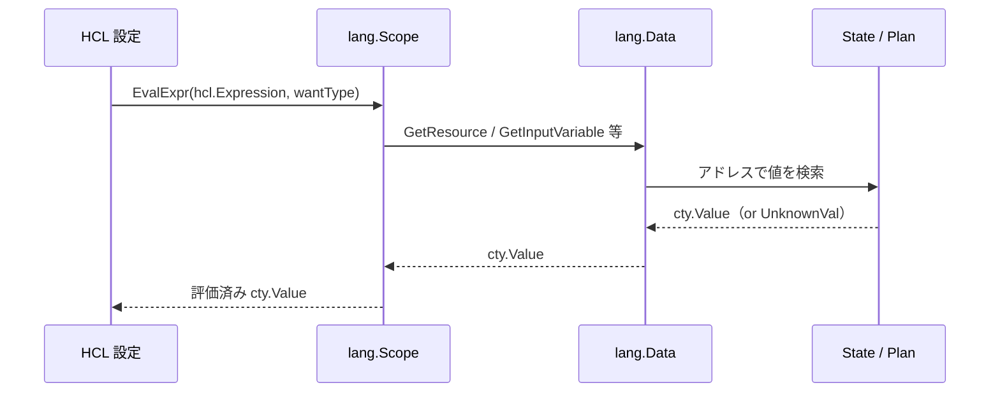
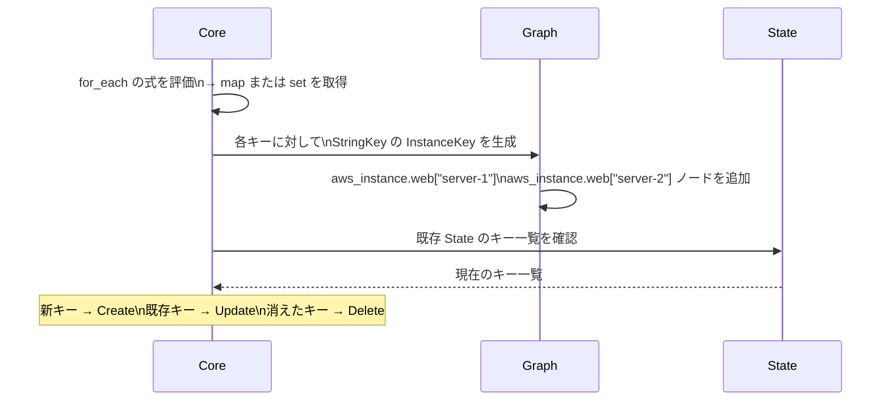
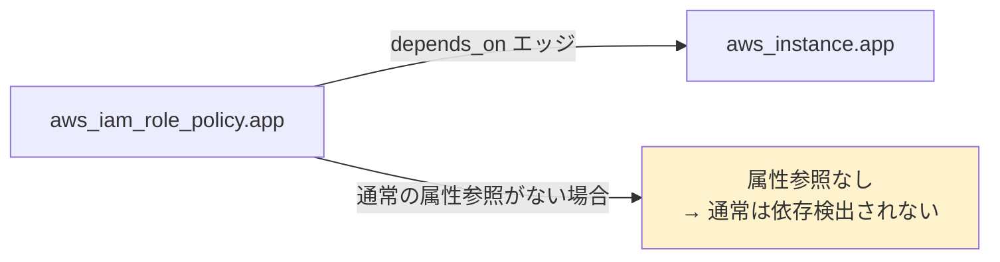

# 式と関数（HCL 評価・depends_on・for_each）

## なぜ Terraform は独自の式評価エンジンを持つのか？

YAML や JSON ではなく HCL（HashiCorp Configuration Language）を使う理由は、
**変数参照・関数呼び出し・条件式をネイティブサポートした設定言語** が必要だったからだ。

JSON では `"${var.env == "prod" ? "t3.large" : "t3.micro"}"` を扱えない。
HCL はこれを言語機能として提供し、さらに Terraform 固有の「unknown 値」も扱える。

---

## 式の評価エンジン



**unknown 値の伝播:**

Plan フェーズで新規リソースの ID が `unknown` の場合、
そのリソースに依存する後続リソースの属性も `unknown` になる。
これが `(known after apply)` の連鎖の原因。

---

## 参照できるオブジェクト一覧

| 参照 | 説明 | 評価フェーズ |
|------|------|------------|
| `var.name` | Input 変数 | Plan 前 |
| `local.name` | ローカル値（locals ブロック） | 依存順に評価 |
| `module.name.output` | 子モジュールの Output | 子モジュール完了後 |
| `resource_type.name.attr` | 管理リソースの属性 | Plan 時は unknown の場合あり |
| `data.type.name.attr` | Data Source の属性 | Plan 前（refresh 時） |
| `count.index` | count 使用時のインデックス | リソース評価時 |
| `each.key` / `each.value` | for_each 使用時のキー・値 | リソース評価時 |
| `self` | provisioner 内での自リソース参照 | Apply 後 |
| `path.module` | 現在のモジュールディレクトリ | 即時 |
| `terraform.workspace` | 現在のワークスペース名 | 即時 |

---

## for 式の使い方

```hcl
# リストの変換
upper_names = [for name in var.names : upper(name)]

# フィルタリング
prod_instances = [for i in var.instances : i if i.env == "prod"]

# マップ変換（キー → 値）
name_to_id = {for r in aws_instance.servers : r.tags.Name => r.id}

# セット → マップ
region_map = {for r in var.regions : r => "enabled"}
```

---

## for_each の内部動作



**count と for_each の決定的な違い:**

```
count = 3 で server-0, server-1, server-2 を作成後、
server-0 を削除したい場合 → count = 2 にすると
server-0 が消えるのではなく server-2 が削除される（インデックスのずれ）

for_each = toset(["server-1", "server-2", "server-3"]) の場合 →
"server-1" を削除しても "server-2", "server-3" は影響なし
```

---

## depends_on の内部動作

```hcl
resource "aws_instance" "app" {
  depends_on = [aws_iam_role_policy.app]
}
```



**なぜ `depends_on` が必要か:**

IAM ポリシーの反映には AWS 内部で数秒の遅延がある（結果整合性）。
`aws_instance` が `aws_iam_role_policy` の属性を直接参照しない場合、
Terraform は依存関係を検出できず並列実行してしまう。

`depends_on` を使うと、**参照先リソースのすべての属性が unknown になるまで評価を遅延** する。
これにより確実な順序実行を保証する。

> **使いすぎに注意**: `depends_on` の過剰使用は Plan/Apply を不必要に遅くする。属性参照で暗黙的依存を表現できる場合は `depends_on` を使わない。

---

## 組み込み関数カテゴリ

| カテゴリ | 代表的な関数 | よく使う場面 |
|---------|------------|------------|
| 文字列 | `format`, `join`, `split`, `replace`, `regex` | 名前の生成、パースに使う |
| コレクション | `merge`, `flatten`, `toset`, `zipmap`, `keys` | マップのマージ、リスト変換 |
| エンコード | `jsonencode`, `base64encode`, `yamlencode` | user_data、ConfigMap の生成 |
| ファイル | `file`, `templatefile` | 外部ファイルの読み込み |
| IP | `cidrsubnet`, `cidrhost` | VPC の CIDR 計算 |
| 型変換 | `tostring`, `tonumber`, `tolist`, `tomap` | 型を明示的に変換 |

---

## dynamic ブロック

```hcl
resource "aws_security_group" "app" {
  dynamic "ingress" {
    for_each = var.ingress_rules
    content {
      from_port   = ingress.value.from_port
      to_port     = ingress.value.to_port
      protocol    = ingress.value.protocol
      cidr_blocks = ingress.value.cidr_blocks
    }
  }
}
```

`dynamic` ブロックは `for_each` と同様に内部で展開され、
`ingress` ブロックを動的に生成する。
`ingress.value` は `for_each` の各要素を指す。

---

## 運用・障害の観点

| シナリオ | 症状 | 対処 |
|---------|------|------|
| unknown の連鎖 | 多くのリソースが `(known after apply)` | 根本リソースを `terraform apply -target` で先に作成 |
| `depends_on` によるパフォーマンス低下 | Apply が直列化して遅い | 属性参照で代替できないか検討。本当に必要な箇所のみに絞る |
| `for` 式でキー重複 | `Error: duplicate key` | `distinct()` や条件フィルタリングでキーの重複を除去 |
| `templatefile` のパス | `Error: No file exists` | `path.module` を使って相対パスを解決する |
| regex の書き方 | `Error: Invalid regexp` | Go の RE2 構文を使う（Perl 互換の一部機能は非対応） |

> **監視指標**: `for` 式や `flatten` などのコレクション操作は Terraform の評価エンジン内で行われるため、大量の要素に対して使うと Plan が遅くなることがある。要素数が数千を超える場合は設計の見直しを検討する。

---

## 関連パッケージ

| パッケージ | 内容 |
|-----------|------|
| `internal/lang` | 式評価スコープ・組み込み関数登録 |
| `internal/lang/funcs` | 組み込み関数の実装 |
| `internal/configs` | HCL パース・式の AST |
| `github.com/zclconf/go-cty` | 型システム（cty） |
| `github.com/hashicorp/hcl/v2` | HCL パーサー・評価エンジン |
