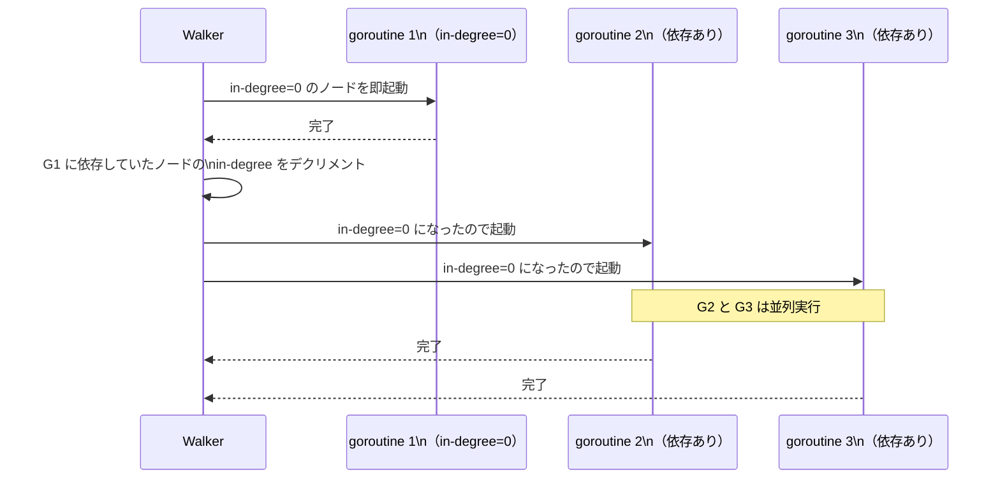
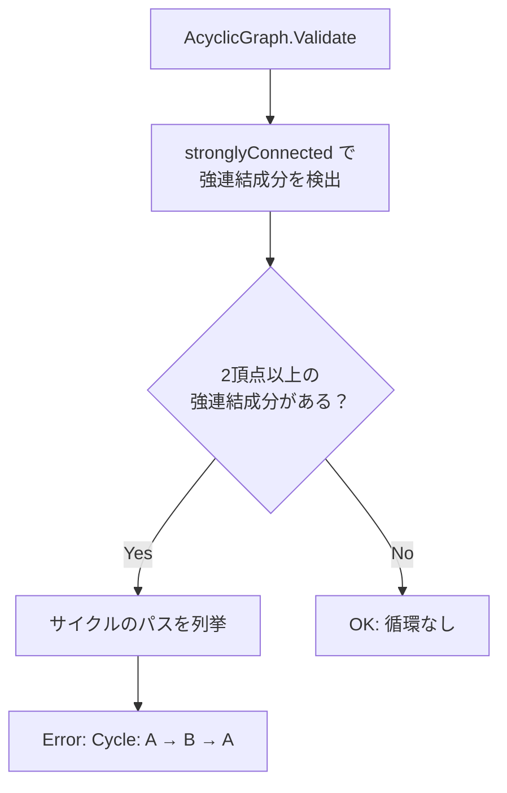

# 依存グラフ（DAG walk アルゴリズム・並列実行・サイクル検出）

## なぜ DAG（有向非巡回グラフ）を使うのか？

リソース間には依存関係がある。
VPC を作ってから Subnet を作り、Subnet を作ってから EC2 を作る。

この依存関係を **DAG** で表現することで、以下を同時に実現している。

| 目的 | 説明 |
|-----|------|
| **順序保証** | 依存元より先に依存先を実行する（トポロジカルソート） |
| **並列実行** | 依存関係のないリソースは goroutine で同時実行する |
| **循環検出** | `A → B → A` のような循環がある場合は早期エラーにする |

> **設計上のポイント**: グラフを使わずにリソースを逐次実行する設計も可能だが、それでは100リソースの Apply が直列になり非現実的に遅くなる。Terraform がスケールするのはこの並列 Walk があるからである。

---

## dag パッケージの基本構造

```go
// internal/dag/graph.go
type Graph struct {
    vertices Set
    edges    *EdgeSet
    downEdges map[interface{}]Set  // ノード → 依存先（先に実行されるもの）
    upEdges   map[interface{}]Set  // ノード → 依存元
}

// AcyclicGraph は循環検出付き
type AcyclicGraph struct {
    Graph
}
```

---

## グラフ構築フロー

```mermaid
graph LR
    A[空の Graph] -->|ConfigTransformer| B[config の resource を頂点に追加]
    B -->|OrphanTransformer| C[State にあるが config にない\nリソースを追加]
    C -->|ProviderTransformer| D[Provider 頂点を追加\nリソースと接続]
    D -->|ReferenceTransformer| E[属性参照を走査して\nエッジを追加]
    E -->|DependsOnTransformer| F[depends_on の\nエッジを追加]
    F -->|DestroyEdgeTransformer| G[Destroy 順序の\nエッジを追加]
    G -->|TransitiveReductionTransformer| H[冗長エッジを削除\n完成した DAG]
```



各 Transformer は `GraphTransformer` インターフェースを実装している。

```go
type GraphTransformer interface {
    Transform(*Graph) error
}
```

---

## Walk アルゴリズム（並列トポロジカル走査）



**並列度の制限:**

```go
// デフォルトは 10 並列
// internal/terraform/context.go
type ContextOpts struct {
    Parallelism int  // -parallelism フラグで変更可能
}
```

`-parallelism=1` にすると完全直列実行になる。
デバッグや API レートリミット回避に使う。

---

## サイクル検出（Tarjan's algorithm）



エラー例:

```
Error: Cycle: module.a.aws_instance.web, module.b.aws_security_group.app
```

> **障害パターン**: `depends_on` を誤って循環させるとこのエラーが出る。`terraform graph | dot -Tsvg > graph.svg` で可視化して依存関係を目視確認するのが最速の解決策。

---

## 並列実行の実例

```mermaid
gantt
    title terraform apply の並列実行タイムライン
    dateFormat  s
    axisFormat  %Ss

    section 実行
    aws_vpc.main           :a1, 0, 3s
    aws_subnet.public      :a2, after a1, 2s
    aws_subnet.private     :a3, after a1, 2s
    aws_instance.web       :a4, after a2, 4s
    aws_instance.app       :a5, after a3, 4s
    aws_lb.main            :a6, after a4, 2s
```



`aws_subnet.public` と `aws_subnet.private` は `aws_vpc.main` にのみ依存し、
互いに無関係なので **並列実行** される。

---

## Destroy Graph の逆順

```mermaid
graph LR
    subgraph Plan Graph（作成順）
        A1[aws_vpc] -->|必要| B1[aws_subnet] -->|必要| C1[aws_instance]
    end

    subgraph Destroy Graph（削除順）
        C2[aws_instance] -->|先に削除| B2[aws_subnet] -->|先に削除| A2[aws_vpc]
    end
```

Destroy Graph はエッジを逆転させることで実現している。
依存される側（VPC）を最後に削除することで、削除時の参照エラーを防ぐ。

---

## デバッグ: グラフの可視化

```bash
# DOT 形式でグラフを出力し SVG に変換
terraform graph | dot -Tsvg > graph.svg

# 種別を指定
terraform graph -type=plan          # Plan グラフ
terraform graph -type=apply         # Apply グラフ
terraform graph -type=plan-destroy  # Destroy グラフ
```

---

## 運用・障害の観点

| シナリオ | 症状 | 対処 |
|---------|------|------|
| サイクルエラー | `Error: Cycle: ...` | `terraform graph` で可視化して `depends_on` の循環を特定 |
| Apply が並列化されない | 全リソースが直列実行になる | 依存チェーンが長い。`terraform graph` で依存関係を確認 |
| `-parallelism` による API エラー | レートリミット超過 | `-parallelism=5` 等で並列度を下げる |
| 孤立リソースが削除されない | State のみにあるリソースが残る | `OrphanTransformer` が動作しているか `TF_LOG=DEBUG` で確認 |

> **監視指標**: Apply 並列数を増やした（`-parallelism` デフォルト 10 超）場合、クラウド API のレートリミットエラーが増加することがある。CloudWatch / Stackdriver でスロットリングメトリクスを確認する。

---

## 関連パッケージ

| パッケージ | 内容 |
|-----------|------|
| `internal/dag` | 汎用 DAG・Walk・サイクル検出 |
| `internal/terraform` | Terraform 固有の Graph ノード・Transformer |
| `internal/command/graph.go` | `terraform graph` コマンド実装 |
