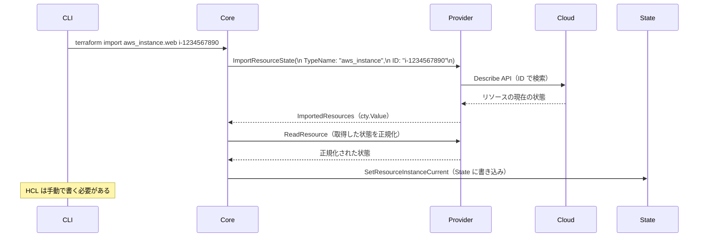
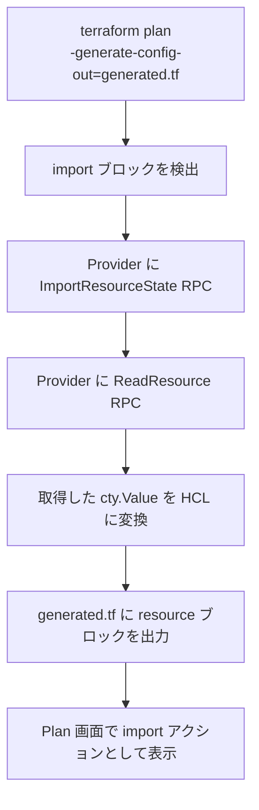
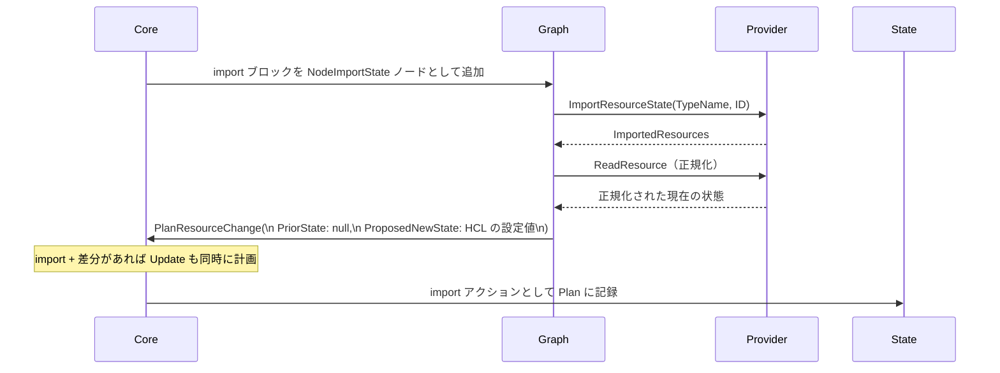

# import ブロックと terraform import（既存リソースの取り込み）

## なぜ import が必要なのか？

Terraform 導入以前に手動・スクリプトで作成したリソースが必ず存在する。
これらを Terraform 管理下に置かないと、「Terraform が知らないリソース」として扱われ、
`terraform destroy` で削除されてしまう危険がある。

`import` はこの「既存リソースを Terraform の State に取り込む」操作を提供する。

| 方法 | 導入バージョン | 特徴 |
|-----|-------------|------|
| `terraform import` コマンド | 古くから | 1リソースずつ、HCL は自分で書く |
| `import` ブロック | 1.5+ | 複数リソースを宣言的に、`-generate-config-out` で HCL 自動生成 |

---

## terraform import コマンド（旧方式）

```bash
terraform import aws_instance.web i-1234567890abcdef0
#               ↑ リソースアドレス    ↑ クラウド側の ID
```

### 内部フロー



**旧方式の問題点:**
- HCL（`resource` ブロック）は自分で書かなければならない
- 1コマンドで1リソースしか import できない
- CI/CD に組み込みにくい

---

## import ブロック（1.5+ 推奨方式）

```hcl
# import.tf
import {
  to = aws_instance.web
  id = "i-1234567890abcdef0"
}

# 対応する resource ブロック（手書き or 自動生成）
resource "aws_instance" "web" {
  ami           = "ami-12345678"
  instance_type = "t3.micro"
}
```

### -generate-config-out による HCL 自動生成

```bash
terraform plan -generate-config-out=generated.tf
```



生成された HCL を確認・編集して `terraform apply` すれば import 完了。

---

## import ブロックの内部フロー（Plan フェーズ）



**重要:** import と同時に差分がある場合、Plan に `import` + `update` が同時に表示される。
apply 1回で import と設定の修正を同時に行える。

---

## for_each を使った複数リソースの一括 import

```hcl
locals {
  instance_ids = {
    "web-1" = "i-1111111111"
    "web-2" = "i-2222222222"
    "web-3" = "i-3333333333"
  }
}

import {
  for_each = local.instance_ids
  to       = aws_instance.web[each.key]
  id       = each.value
}

resource "aws_instance" "web" {
  for_each      = local.instance_ids
  ami           = "ami-12345678"
  instance_type = "t3.micro"
}
```

旧コマンド方式ではこれを3回実行する必要があったが、
`import` ブロック + `for_each` で1回の apply で済む。

---

## Go の実装

```go
// internal/command/import.go（旧コマンド方式）
type ImportCommand struct {
    Meta
}

// import ブロック方式は Plan フェーズで処理
// internal/terraform/node_module_expand.go
// internal/terraform/node_resource_abstract_instance.go
// → NodeAbstractResourceInstance.executeWriteState() で State 書き込み
```

---

## 運用・障害の観点

| シナリオ | 症状 | 対処 |
|---------|------|------|
| import 後に大量の diff が出る | Plan で `~` が多数表示される | 生成 HCL を実態に合わせて修正。`ignore_changes` で一部を無視 |
| ID の形式がわからない | `Error: Cannot import non-existent remote object` | Provider のドキュメントで import ID の形式を確認 |
| import 後に destroy される | 依存リソースが `terraform destroy` で消える | import したリソースを `prevent_destroy = true` で保護 |
| 大量 import が遅い | 数百リソースの import に時間がかかる | `-parallelism` を増やす。または分割して import |

> **監視指標**: import 後の初回 `terraform plan` で差分が多い場合は、HCL が実態と乖離している。差分をゼロにしてから本番適用することを強く推奨する。差分がある状態で apply すると意図しない変更が加わる。

---

## 関連パッケージ

| パッケージ | 内容 |
|-----------|------|
| `internal/command/import.go` | `terraform import` コマンド実装 |
| `internal/terraform` | import ブロックの Graph ノード処理 |
| `internal/providers` | `ImportResourceState` RPC インターフェース |
