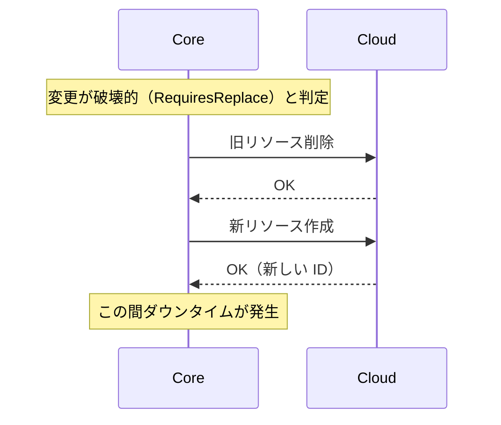
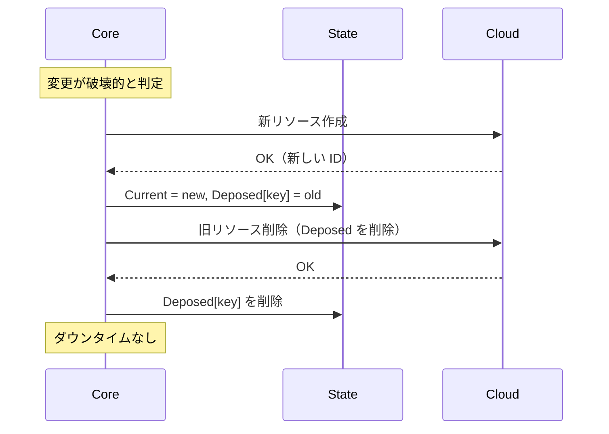
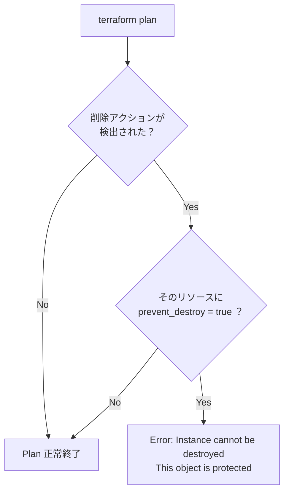
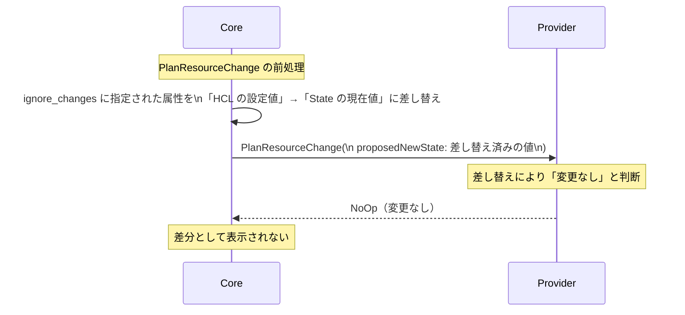
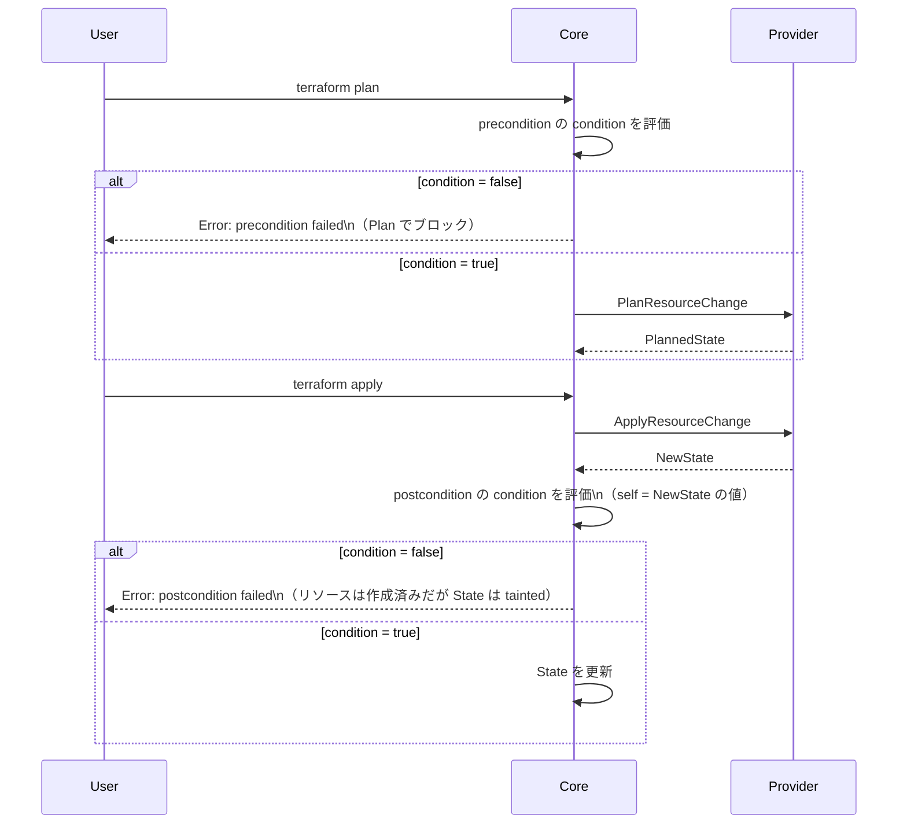

# リソースライフサイクル（create_before_destroy・ignore_changes・precondition/postcondition）

## なぜ lifecycle ブロックが必要なのか？

Terraform のデフォルト動作はシンプルだが、現実のインフラ運用には例外が多い。

| 問題 | lifecycle での解決 |
|-----|------------------|
| 変更時に削除→再作成でダウンタイムが発生する | `create_before_destroy = true` |
| 外部で変更される属性（タグ等）を毎回差分として出したくない | `ignore_changes` |
| 誤って本番 DB を削除させたくない | `prevent_destroy = true` |
| 別リソースの変更に連動して強制再作成したい | `replace_triggered_by` |
| API 固有のバリデーションをコードに書きたい | `precondition` / `postcondition` |

---

## lifecycle ブロック全体像

```hcl
resource "aws_instance" "app" {
  lifecycle {
    create_before_destroy = true
    prevent_destroy       = true
    ignore_changes        = [tags, ami]
    replace_triggered_by  = [aws_launch_template.app.id]

    precondition {
      condition     = var.instance_type != "t2.micro"
      error_message = "t2.micro は本番環境では使用禁止"
    }

    postcondition {
      condition     = self.public_ip != ""
      error_message = "インスタンスに public IP が割り当てられていない"
    }
  }
}
```

---

## create_before_destroy のフロー

**通常の Replace（デフォルト）:**



**create_before_destroy = true:**



**クラッシュ時のリカバリ:**

Apply 中にクラッシュすると State に `Deposed` が残り続ける。
次回 `terraform apply` で `"instance is deposed"` 警告が出るが、
そのまま apply すれば自動的に削除される。

> **障害パターン**: `create_before_destroy` でリソースを大量に持つ場合、新旧両方が一時的に存在する。クォータ（EC2 インスタンス数など）に余裕がないと `InsufficientInstanceCapacity` や quota exceeded エラーが発生する。

---

## prevent_destroy のチェックポイント



**注意:** `terraform state rm` は `prevent_destroy` の影響を **受けない**。
State からリソースを除外するだけで実リソースは削除しないため、
`prevent_destroy` は「実リソースを Terraform が削除しないように」するための設定。

---

## ignore_changes の内部動作



**`ignore_changes = all` の使いどころ:**

外部システム（Ansible、手動操作）で管理される属性があるリソースで使う。
ただし Terraform が実質的にそのリソースを「監視しない」状態になるため、
本当に必要な変更も検出されなくなるリスクがある。

---

## replace_triggered_by（Terraform 1.2+）

```hcl
resource "aws_autoscaling_group" "app" {
  lifecycle {
    replace_triggered_by = [
      aws_launch_template.app.latest_version
    ]
  }
}
```

**なぜ必要か:**

`aws_autoscaling_group` は `aws_launch_template` を直接の属性として持つが、
`latest_version` が変わっても ASG の属性変更にはならない。
`replace_triggered_by` を使うことで、Launch Template の更新時に ASG の Replace を強制できる。

---

## precondition / postcondition のフロー



### variable validation との違い

| 機能 | 評価タイミング | 参照できる値 | 用途 |
|------|--------------|------------|------|
| `variable validation` | 変数評価時（Plan 前） | `var.xxx` のみ | 入力値の基本チェック |
| `precondition` | Plan 時 | data source・他リソースも可 | クロスリソースの事前検証 |
| `postcondition` | Apply 後 | `self`（適用後の値） | API 応答値の検証 |

---

## 運用・障害の観点

| シナリオ | 症状 | 対処 |
|---------|------|------|
| Deposed が残る | `"instance is deposed"` 警告 | `terraform apply` で自動削除。または `terraform state rm` |
| クォータ不足で CBD 失敗 | quota exceeded エラー | クォータを増やすか、`create_before_destroy = false` に戻して計画的に Replace |
| `prevent_destroy` で destroy できない | `Error: Instance cannot be destroyed` | 一時的に `prevent_destroy = false` にして apply 後に destroy |
| postcondition 失敗でリソースが tainted | tainted なリソースが State に残る | `terraform apply` で tainted リソースの再作成が提案される |
| `ignore_changes` で必要な更新が反映されない | 設定変更が Plan に出ない | `ignore_changes` のリストから該当属性を削除 |

> **監視指標**: `create_before_destroy` が頻発するリソース（例: EC2 の AMI 変更）では、クラウドのリソースクォータに余裕を持たせる。CloudWatch の `ServiceQuota` メトリクスでクォータ使用率を監視する。

---

## 関連パッケージ

| パッケージ | 内容 |
|-----------|------|
| `internal/configs` | lifecycle ブロックのパース |
| `internal/terraform` | precondition/postcondition の評価ロジック |
| `internal/states` | Deposed・Tainted の管理 |
| `internal/plans` | replace_triggered_by の Plan への反映 |
