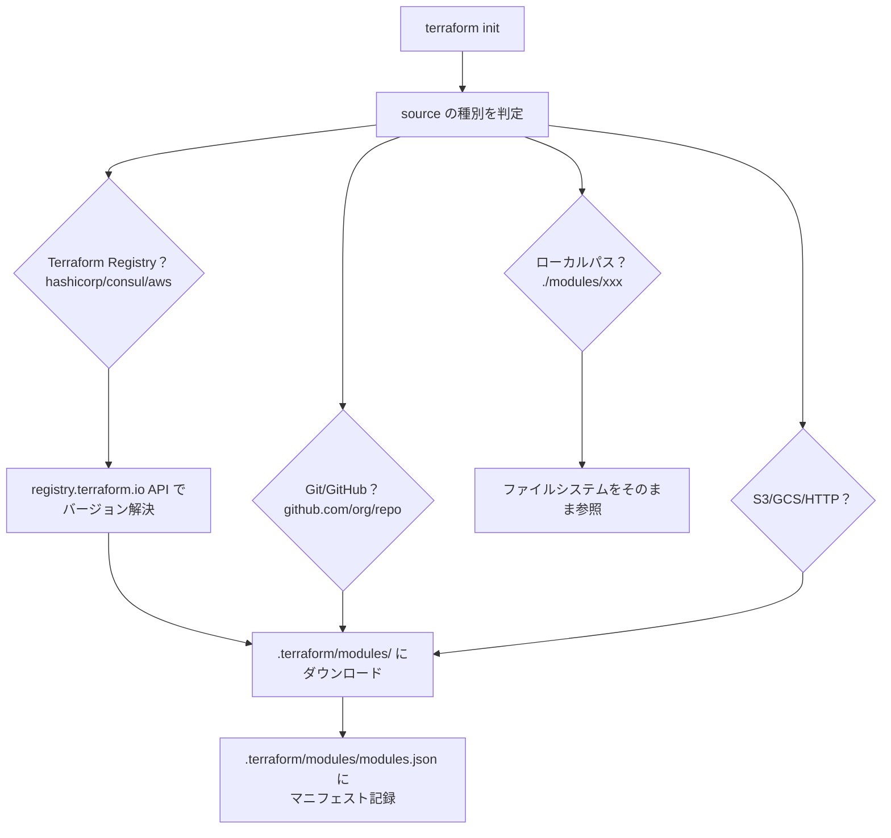
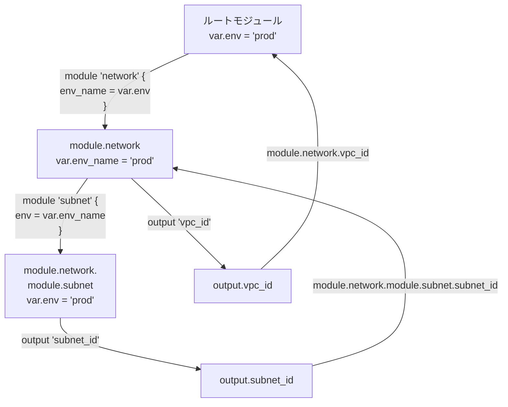

# モジュールシステム（モジュール解決・変数・出力の伝播）

## なぜモジュールが必要なのか？

Terraform でインフラを管理し続けると、同じパターンが繰り返し現れる。
「VPC + Subnet + IGW のセット」「ECS タスク定義 + サービス + ALB のセット」などだ。

モジュールはこの繰り返しを **パラメータ化された再利用単位** として抽象化する。

| モジュールを使う理由 | 説明 |
|-------------------|------|
| **DRY 原則** | 同じ設定を dev / staging / prod で重複させない |
| **抽象化** | 利用者は内部実装を知らなくてもよい（インターフェースのみ公開） |
| **バージョン管理** | Registry モジュールはセマンティックバージョニングで管理できる |
| **テスト可能性** | モジュール単体で `terraform test` を実行できる |

> **設計上のトレードオフ**: モジュールを深くネストすると State の参照が複雑になり、デバッグが難しくなる。一般的に3階層以上のネストは避けることが推奨される。

---

## モジュール呼び出しの構文

```hcl
module "network" {
  source  = "./modules/network"
  version = "~> 1.0"  # レジストリ時のみ有効

  vpc_cidr = "10.0.0.0/16"
  env_name = var.environment
}

# 子モジュールの output を参照
resource "aws_instance" "app" {
  subnet_id = module.network.public_subnet_id
}
```

---

## モジュールのソース種別と解決フロー



---

## 内部の Module アドレス体系

```go
// internal/addrs/module.go

// Module はモジュール階層のパス（文字列スライス）
type Module []string
// 例: [] (root), ["network"], ["network", "subnet"]

// ModuleInstance はインスタンス化されたモジュール
// count や for_each 使用時に複数インスタンスが存在する
type ModuleInstance []ModuleInstanceStep

type ModuleInstanceStep struct {
    Name        string
    InstanceKey InstanceKey  // count → IntKey、for_each → StringKey
}
// 例: module.network[0].module.subnet["public"]
```

---

## 変数と Output の伝播フロー



**値の伝播は一方向**（親 → 子は変数、子 → 親は output）であり、
これにより依存グラフの循環を防いでいる。

---

## for_each / count によるインスタンス化

```hcl
# count
module "servers" {
  count  = 3
  source = "./modules/server"
  index  = count.index
}
# → module.servers[0], module.servers[1], module.servers[2]

# for_each（キーが State のアドレスになる）
module "regions" {
  for_each = toset(["us-east-1", "ap-northeast-1"])
  source   = "./modules/regional"
  region   = each.key
}
# → module.regions["us-east-1"], module.regions["ap-northeast-1"]
```

**count と for_each の使い分け:**

`count` はインデックスが State のキーになるため、
途中のリソースを削除すると後続のインデックスがずれて **大量の Replace** が発生する。

`for_each` は文字列キーが State のキーになるため、
他のリソースに影響せず安全に追加・削除できる。

---

## Go の Config 型構造

```go
// internal/configs/config.go
type Config struct {
    Module   *Module
    Path     addrs.Module
    Children map[string]*Config  // 子モジュール
    Root     *Config
    Parent   *Config
}

type Module struct {
    SourceDir        string
    Variables        map[string]*Variable
    Outputs          map[string]*Output
    ManagedResources map[string]*Resource
    DataResources    map[string]*Resource
    ModuleCalls      map[string]*ModuleCall
}
```

---

## 運用・障害の観点

| シナリオ | 症状 | 対処 |
|---------|------|------|
| count → for_each に変更 | 大量の `-/+` Replace が発生 | `moved` ブロックで State のアドレスを移行する |
| モジュールのバージョン変更 | 破壊的変更が含まれる場合 | `terraform plan` で差分確認。`~>` でパッチバージョンのみ許可 |
| .terraform/modules が壊れる | `Error: Module not installed` | `terraform init` を再実行 |
| modules.json とファイルの不整合 | `Error reading module` | `.terraform/modules/` を削除して `terraform init` |
| 深いネストでのデバッグ | どのモジュールのリソースかわからない | `terraform state list` でアドレスを確認 |

> **監視指標**: モジュールのソースを Registry から取得している場合、`terraform init` に時間がかかることがある。CI では `.terraform/` をキャッシュすることで初期化時間を短縮できる。ただしキャッシュが古い場合は `terraform init -upgrade` が必要。

---

## 関連パッケージ

| パッケージ | 内容 |
|-----------|------|
| `internal/configs` | モジュール Config のロード・パース |
| `internal/addrs` | Module/ModuleInstance アドレス型 |
| `internal/modsdir` | モジュールキャッシュ（.terraform/modules） |
| `internal/getmodules` | モジュールのダウンロード・取得 |
| `internal/registry` | Terraform Registry API クライアント |
