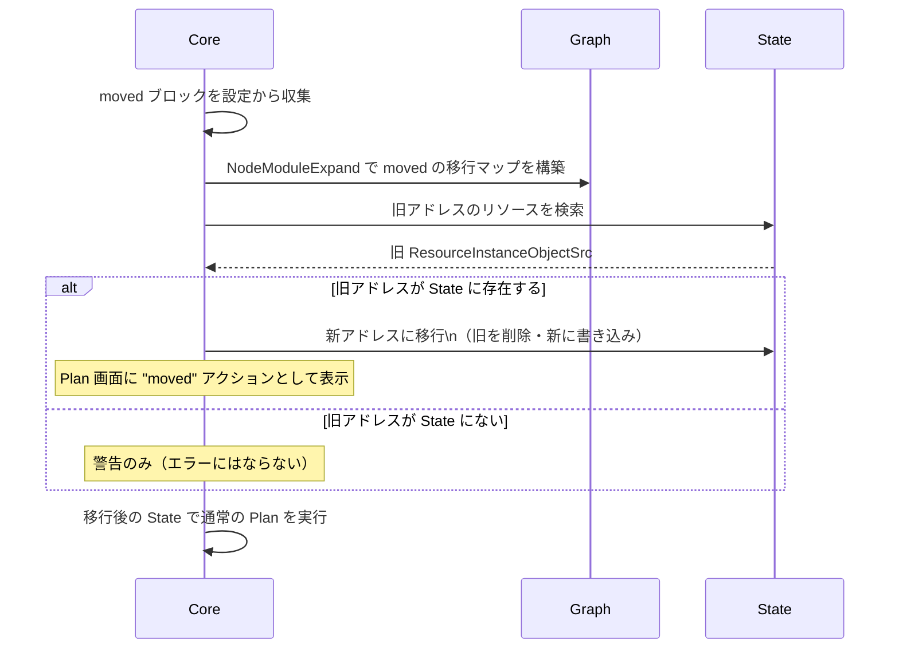

# moved ブロック（State リファクタリング）

## なぜ moved ブロックが必要なのか？

Terraform でリファクタリングを行うと、リソースのアドレスが変わることがある。

例：
- `aws_instance.web` → `module.ec2.aws_instance.web`（モジュール化）
- `aws_instance.server[0]` → `aws_instance.server["web"]`（count → for_each 移行）
- `aws_instance.old_name` → `aws_instance.new_name`（リネーム）

アドレスが変わると Terraform は「旧リソースを削除して新リソースを作成」と解釈する。
**実際には何も変わっていないのに、リソースの再作成（ダウンタイム）が発生してしまう。**

`moved` ブロックはこの問題を解決する。
「旧アドレス → 新アドレスへの State の移行」を宣言的に記述できる。

---

## moved ブロックの構文

```hcl
# リネーム
moved {
  from = aws_instance.old_name
  to   = aws_instance.new_name
}

# モジュール化（フラット → モジュール）
moved {
  from = aws_instance.web
  to   = module.ec2.aws_instance.web
}

# count → for_each の移行
moved {
  from = aws_instance.server[0]
  to   = aws_instance.server["web-1"]
}

moved {
  from = aws_instance.server[1]
  to   = aws_instance.server["web-2"]
}
```

---

## 内部フロー



Plan の出力例：

```
# aws_instance.old_name has moved to aws_instance.new_name
resource "aws_instance" "new_name" {
    id = "i-1234567890"
    # (no changes)
}
```

---

## count → for_each 移行の実践例

`count` から `for_each` への移行は最も一般的なユースケース。

```hcl
# 移行前
resource "aws_instance" "server" {
  count         = 2
  instance_type = "t3.micro"
}
# State: aws_instance.server[0], aws_instance.server[1]

# 移行後
resource "aws_instance" "server" {
  for_each      = toset(["web", "app"])
  instance_type = "t3.micro"
}
# State（目標）: aws_instance.server["web"], aws_instance.server["app"]

# moved ブロック（移行を宣言）
moved {
  from = aws_instance.server[0]
  to   = aws_instance.server["web"]
}
moved {
  from = aws_instance.server[1]
  to   = aws_instance.server["app"]
}
```

`moved` なしで移行すると `-/+`（削除→再作成）が2件発生する。
`moved` を追加すると `moved`（アドレス変更のみ）として Plan に表示され、
実リソースへの変更はゼロになる。

---

## モジュール全体の moved

```hcl
# モジュール自体のアドレス変更
moved {
  from = module.old_network
  to   = module.network
}

# for_each モジュールへの移行
moved {
  from = module.server[0]
  to   = module.server["web"]
}
```

---

## removed ブロック（1.7+）

`moved` の逆で、「リソースを Terraform 管理から外す（State から削除するが実リソースは消さない）」を宣言する。

```hcl
removed {
  from = aws_instance.legacy

  lifecycle {
    destroy = false  # 実リソースは削除しない（State のみ削除）
  }
}
```

`destroy = true`（デフォルト）にすると、apply 時に実リソースも削除される。

---

## Go の実装

```go
// moved ブロックのパース
// internal/configs/moved_block.go
type Move struct {
    From hcl.Traversal
    To   hcl.Traversal
    // ...
}

// State 移行の実行
// internal/refactoring/move_statement.go
// ApplyMoves() が Plan フェーズで呼ばれ、State のアドレスを書き換える
func ApplyMoves(stateRoot *states.State, moves []MoveStatement) MoveResults
```

---

## 運用・障害の観点

| シナリオ | 症状 | 対処 |
|---------|------|------|
| moved を書き忘れてリファクタリング | `-/+` が大量に Plan に出る | `terraform plan` で確認してから `moved` を追加して再 Plan |
| moved の from/to を逆に書く | 意図しないリソースが削除される | `terraform plan` で必ず確認してから apply |
| moved 後に from アドレスが残る | 旧アドレスのリソースが State に残る | `terraform state rm` で手動削除 |
| チームで moved を削除するタイミング | 削除後に古い State を持つメンバーが apply するとエラー | 全員が apply し終わってから moved ブロックを削除する |

> **運用のコツ**: `moved` ブロックは永続的に残すのではなく、全メンバーが apply した後に削除するのが推奨。ただし削除する前に `terraform plan` でゼロ差分を確認すること。

---

## 関連パッケージ

| パッケージ | 内容 |
|-----------|------|
| `internal/configs` | moved/removed ブロックのパース |
| `internal/refactoring` | State アドレス移行の実行ロジック |
| `internal/addrs` | アドレス変換の型定義 |
