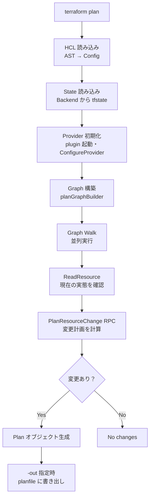
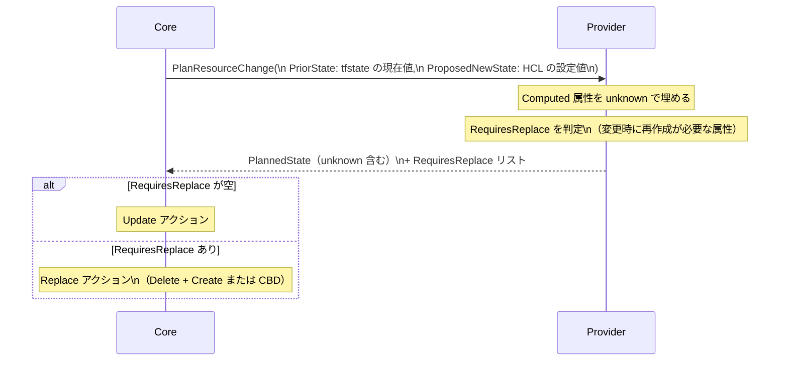
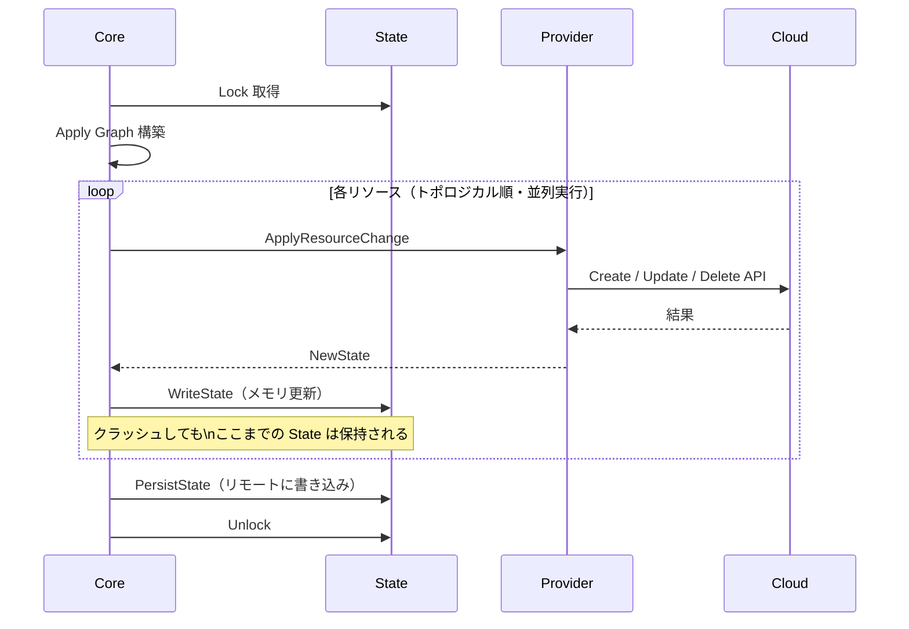
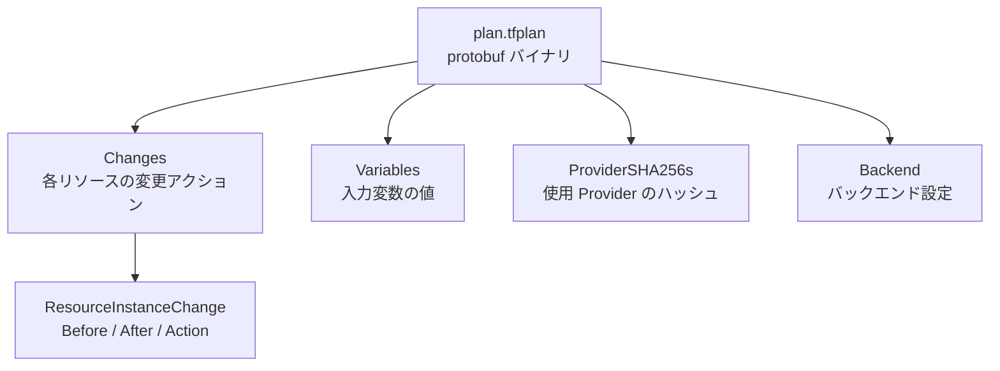

# Plan/Apply ライフサイクル（diff 計算・変更適用の内部フロー）

## なぜ Plan と Apply を分けるのか？

「計算」と「実行」を分離することで、以下を実現している。

| 分離の目的 | 説明 |
|-----------|------|
| **変更の事前確認** | 本番環境への適用前に差分を人間がレビューできる |
| **冪等性の保証** | 同じ Plan を何度 Apply しても同じ結果になる |
| **CI/CD との統合** | Plan を PR レビューに組み込み、Apply を承認後に実行できる |
| **planfile による再現性** | `-out` で保存した planfile を使うと、確認した内容と完全に一致した Apply ができる |

---

## Plan フェーズの全体フロー

---

## Graph 構築の段階

Plan Graph は複数の `GraphTransformer` が順番に適用されて構築される。

```mermaid
graph LR
    A[空の Graph] -->|ConfigTransformer| B[config のリソースを追加]
    B -->|OrphanTransformer| C[State のみにある\n孤立リソースを追加]
    C -->|ProviderTransformer| D[Provider ノードを追加\nリソースと接続]
    D -->|ReferenceTransformer| E[属性参照からエッジを追加]
    E -->|DependsOnTransformer| F[depends_on のエッジを追加]
    F -->|DestroyEdgeTransformer| G[Destroy 順序のエッジを追加]
    G -->|TransitiveReduction| H[冗長エッジを削除\n完成した DAG]
```

TransitiveReduction（推移的簡約）を行う理由:
A→B、B→C、A→C という冗長なエッジがあると、並列実行の効率が下がる。
A→C を削除して A→B→C のみにすることで、不要な待ち合わせをなくす。

---

## PlanResourceChange のシーケンス

**unknown（`(known after apply)`）の意味:**

Provider は新規リソースの ID や IP アドレスなど、
実際に API を呼ぶまで確定しない値を `cty.UnknownVal` で返す。

これが Plan 画面の `(known after apply)` の正体であり、
後続リソースがこの値に依存する場合、そのリソースの Plan も unknown になる。

---

## 変更アクション一覧

| アクション | 説明 | 表示 |
|-----------|------|------|
| `Create` | 新規リソース作成 | `+` |
| `Update` | in-place 更新 | `~` |
| `Delete` | リソース削除 | `-` |
| `Replace` | 削除して再作成（破壊的） | `-/+` |
| `Read` | Data Source の読み取り | `<=` |
| `NoOp` | 変更なし | （表示なし） |
| `Forget` | State から除去（実リソースは削除しない） | `×` |

---

## Apply フェーズのフロー

**Apply 中の State 部分更新が重要な理由:**

各リソース完了ごとにメモリの State を更新することで、
Apply 途中にクラッシュしても「完了済みリソース」は State に残る。
次回 `terraform apply` では差分のみを再実行できる。

---

## planfile の構造

**なぜ planfile にハッシュを含めるのか？**

Plan 時と Apply 時で異なる Provider バイナリが使われると、
差分計算の前提が変わり、予期しない変更が発生する可能性がある。
ハッシュ検証によってこれを防いでいる。

---

## 運用・障害の観点

| シナリオ | 症状 | 対処 |
|---------|------|------|
| Plan が遅い | 数分かかる | Provider の `ReadResource`（refresh）が遅い。`-refresh=false` で一時回避 |
| `(known after apply)` が連鎖 | 多くのリソースが unknown になる | 依存チェーンの根本リソースを先に apply するか、`-target` を使う |
| Apply 途中でクラッシュ | State に一部リソースのみ記録 | `terraform apply` を再実行。`terraform state list` で状況確認 |
| planfile の Apply が失敗 | `Provider produced invalid plan` | Plan 後に State が変更された（他の Apply が先に走った）。再 Plan が必要 |
| Replace が意図せず発生 | `-/+` が予期せず出る | `RequiresReplace` を返した属性を確認。`ignore_changes` で回避できる場合がある |

> **監視指標**: Apply の実行時間を CI でトラッキングし、増加傾向があればリソース数の増大か Provider API の遅延かを特定する。

---

## 関連パッケージ

| パッケージ | 内容 |
|-----------|------|
| `internal/terraform` | Plan/Apply の主要ロジック・Graph Walker |
| `internal/plans` | Plan 型定義・protobuf シリアライズ |
| `internal/dag` | DAG 実装（走査・並列実行） |
| `internal/command/views` | Plan 結果の表示フォーマット |
