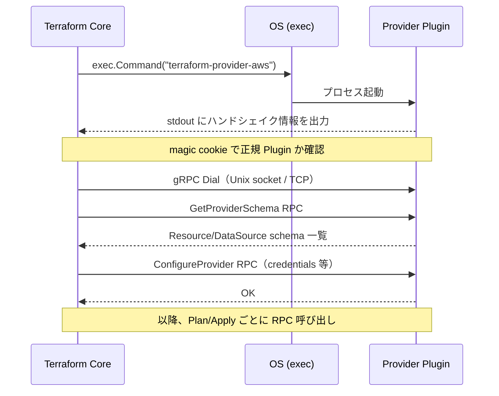
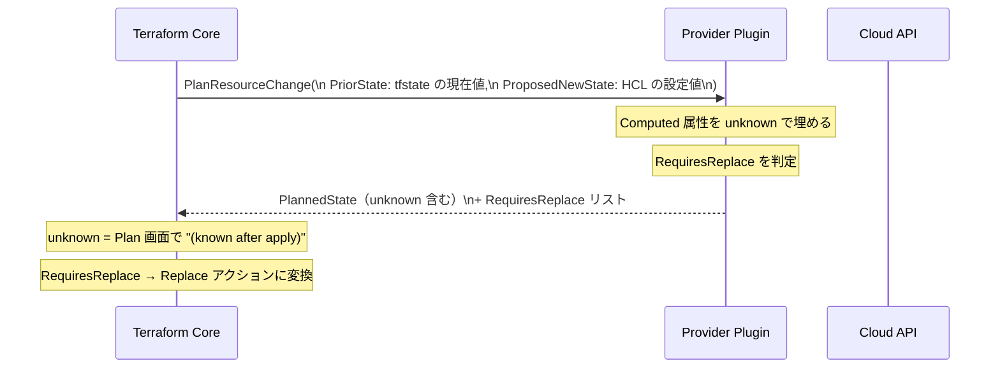
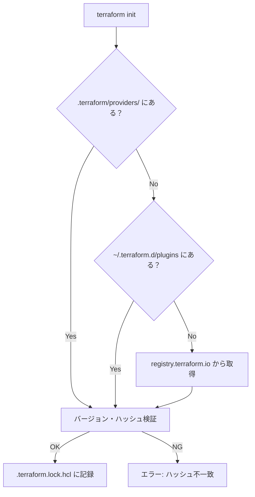

# プロバイダープラグイン（gRPC プロトコル・Plugin Protocol）

## なぜ Provider は別プロセスなのか？

Provider を Core と同一プロセスに組み込む設計も可能だが、Terraform はあえて **別プロセス + RPC** を選んでいる。

| 設計上の理由 | 説明 |
|------------|------|
| **クラッシュ隔離** | Provider がパニックしても Core プロセスは生き残り、State を安全に保存できる |
| **独立リリース** | Core と Provider のバージョンを独立して更新できる（AWS Provider v5 が出ても Core を変えなくてよい） |
| **言語非依存** | Provider は Go 以外の言語でも実装できる（実際は Go が主流だが、プロトコル仕様さえ満たせばよい） |
| **サードパーティ拡張** | HashiCorp 以外が Provider を開発・配布できる（Registry エコシステムの基盤） |

> **SRE 視点**: Provider クラッシュは `Error: Plugin did not respond` として Core に伝わる。このエラーが頻発する場合は Provider バイナリの破損やメモリ不足を疑う。

---

## Plugin Protocol の進化

| バージョン | 通信方式 | 導入 | 主な追加 |
|-----------|---------|------|---------|
| Protocol v5 | gRPC + protobuf | Terraform 0.12 | 基本 CRUD RPC |
| Protocol v6 | gRPC + protobuf | Terraform 1.0 | Nested attributes、`MoveResourceState`（1.8+） |

### なぜ v5 → v6 で Nested attributes が必要だったのか？

v5 では `Block` の中に `Block` を入れる構造しか表現できず、AWS の複雑なリソース（例: `aws_s3_bucket` の `versioning` 内の `rule`）を単一の属性として扱えなかった。v6 の `NestedAttribute` により、オブジェクト型の属性を `Attribute` として定義でき、`Required`/`Optional`/`Computed` を細かく制御できるようになった。

---

## プロセス起動フロー



**magic cookie とは？**
`go-plugin` ライブラリが環境変数 `PLUGIN_MAGIC_COOKIE` を使って、Terraform が起動した正規のプラグインかどうかを確認する仕組み。不正なバイナリを誤って実行しないための安全弁。

---

## gRPC RPC 一覧と設計意図

| RPC | タイミング | なぜ Core 側でなく Provider 側が持つのか |
|-----|-----------|--------------------------------------|
| `GetProviderSchema` | init 後 | クラウド API の構造は Provider だけが知っている |
| `ConfigureProvider` | Plan/Apply 前 | 認証情報は Provider ごとに異なる（SDK 固有の初期化） |
| `ValidateResourceConfig` | Plan 前 | API 固有のバリデーション（例: S3 バケット名の文字制限） |
| `PlanResourceChange` | Plan | Computed 属性の予測値は Provider の API 知識が必要 |
| `ApplyResourceChange` | Apply | 実際の API 呼び出しは Provider が担当 |
| `ReadResource` | refresh | 現在の実態は API に問い合わせないとわからない |
| `ImportResourceState` | import | 既存リソースの読み取り方は Provider が知っている |
| `MoveResourceState` | moved ブロック | アドレス変更時の State 変換ロジックは Provider が持つ |

---

## PlanResourceChange のシーケンス



> **障害パターン**: `PlanResourceChange` がタイムアウトする場合、Provider が外部 API（STS、GCP metadata server 等）に依存している可能性がある。`TF_LOG=DEBUG` で gRPC の往復時間を確認する。

---

## cty 型システム ― なぜ独自型が必要か？

Go の標準型（`string`, `int`）では Terraform の「値がまだ不明」という状態を表現できない。

```
cty.UnknownVal(cty.String)  // Plan 時の "(known after apply)"
cty.NullVal(cty.String)     // null（設定なし）
cty.StringVal("prod")       // 確定した値
```

この3値が区別できないと、Plan 時に「変更があるかどうか」を正しく計算できない。

| cty 値 | 意味 | 具体例 |
|--------|------|--------|
| `UnknownVal` | 適用後にしか確定しない | 新規作成リソースの ID |
| `NullVal` | 明示的な null | `optional` 属性を省略した場合 |
| `StringVal(v)` | 確定値 | `"ap-northeast-1"` |

---

## Provider の検索・インストールフロー



> **障害パターン**: CI 環境で `Error: Failed to install provider` が発生する場合、registry へのアウトバウンド通信がブロックされているか、`.terraform.lock.hcl` のハッシュが環境と一致していない（OS/アーキテクチャ違い）ことが多い。`terraform providers lock -platform=linux_amd64` で事前にロックファイルに複数プラットフォームのハッシュを追加する。

---

## 運用・監視の観点

| 監視項目 | 確認方法 | 閾値の目安 |
|---------|---------|-----------|
| Provider RPC のレイテンシ | `TF_LOG=DEBUG` のタイムスタンプ | `ApplyResourceChange` が 30 秒超 → API 側の問題 |
| Provider プロセスの異常終了 | `Error: Plugin did not respond` | 発生時は Provider バージョン・メモリを確認 |
| ロック取得の失敗 | `Error acquiring the state lock` | DynamoDB のスロットリング or 前回 Apply の異常終了 |
| Provider バージョンのドリフト | `.terraform.lock.hcl` の差分 | CI とローカルで `lock.hcl` の差分が出たら要調査 |

---

## 関連パッケージ

| パッケージ | 内容 |
|-----------|------|
| `internal/providers` | Provider インターフェース定義 |
| `internal/plugin` | gRPC クライアント実装（plugin5） |
| `internal/plugin6` | gRPC クライアント実装（plugin6） |
| `internal/providercache` | Provider バイナリキャッシュ管理 |
| `internal/getproviders` | Provider 取得・インストール |
