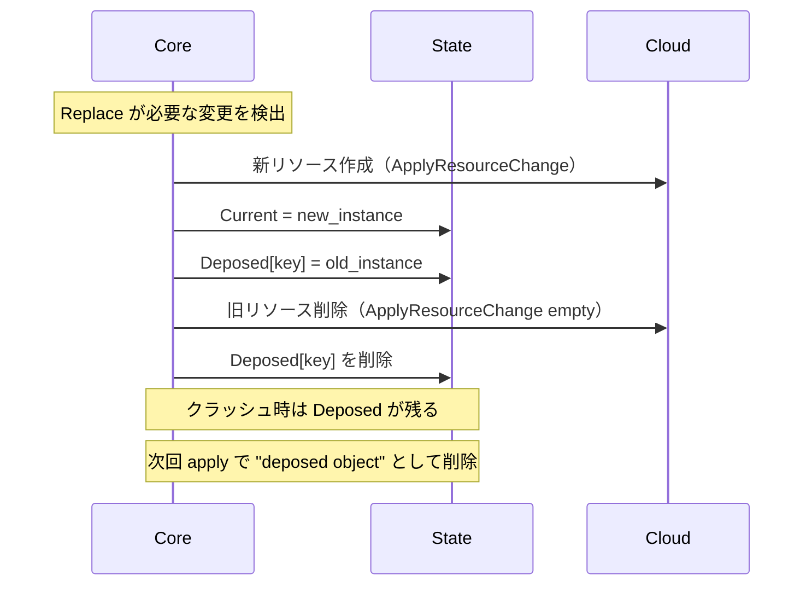
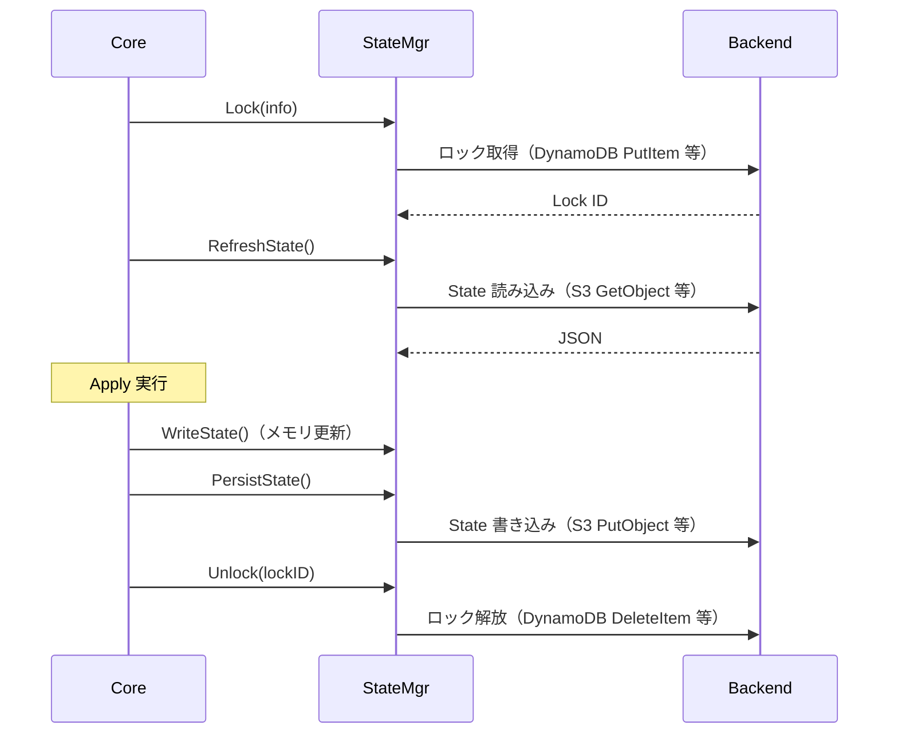

# ステート管理（tfstate 構造・Remote Backend・Locking）

## なぜ State が必要なのか？

Terraform はクラウド API だけでは「現在の状態」を完全に把握できない。

理由は3つある。

1. **API の全量取得は遅い** — アカウント内の全リソースを毎回スキャンするのはコストが高い
2. **API が全情報を返さない** — 作成時のパラメータ（例: `user_data`）は Read API で取得できないものがある
3. **依存関係の記録** — どのリソースがどのリソースに依存しているかをクラウドは知らない

State はこれらの問題を解決する **ローカルキャッシュ兼依存マップ** として機能する。

> **設計上のトレードオフ**: State を持つことで「コードと実態と State の3者が一致しているか」を常に気にする必要が生まれる。これが State ドリフト問題の根本原因でもある。

---

## tfstate の JSON 構造

```json
{
  "version": 4,
  "terraform_version": "1.5.0",
  "serial": 42,
  "lineage": "550e8400-e29b-41d4-a716-446655440000",
  "outputs": {
    "bucket_name": {
      "value": "my-bucket",
      "type": "string"
    }
  },
  "resources": [
    {
      "module": "module.network",
      "mode": "managed",
      "type": "aws_vpc",
      "name": "main",
      "provider": "provider[\"registry.terraform.io/hashicorp/aws\"]",
      "instances": [
        {
          "schema_version": 1,
          "attributes": {
            "id": "vpc-12345678",
            "cidr_block": "10.0.0.0/16"
          },
          "sensitive_attributes": [],
          "dependencies": ["aws_internet_gateway.main"]
        }
      ]
    }
  ]
}
```

### 主要フィールドの意味

| フィールド | 説明 | 障害での意味 |
|-----------|------|------------|
| `version` | State フォーマットのバージョン（現在 4） | 古い Terraform で新 State を開くと `version mismatch` エラー |
| `serial` | 変更のたびにインクリメントされるカウンター | 2つの Apply が同じ serial で競合すると一方が失敗する |
| `lineage` | State の UUID（初回作成時に生成） | 異なる `lineage` の State を上書きしようとするとエラーになる |
| `sensitive_attributes` | 機密値のパス一覧 | **State には平文で保存される**。S3 の場合は暗号化必須 |

---

## Go の State 型構造

```go
// internal/states/state.go
type State struct {
    Modules map[string]*Module
}

type Module struct {
    Resources    map[string]*Resource
    OutputValues map[string]*OutputValue
}

type Resource struct {
    Addr           addrs.AbsResource
    EachMode       EachMode  // NoEach / EachList / EachMap
    Instances      map[addrs.InstanceKey]*ResourceInstance
    ProviderConfig addrs.AbsProviderConfig
}

type ResourceInstance struct {
    Current *ResourceInstanceObjectSrc
    Deposed map[DeposedKey]*ResourceInstanceObjectSrc
}
```

---

## Deposed（廃棄待ち）インスタンスの仕組み

`create_before_destroy = true` のリソースを変更すると Deposed が発生する。



> **障害パターン**: Apply 中にクラッシュすると `Deposed` が State に残り続ける。次回 `terraform apply` で `"instance is deposed"` という警告が出るが、そのまま apply すると正常に削除される。強制的に削除したい場合は `terraform state rm` を使う。

---

## State の読み書きフロー



---

## Remote Backend と State Locking

### なぜロックが必要か？

複数人が同時に `terraform apply` を実行すると、State の `serial` が競合し、後から書いた方が前の変更を上書きしてしまう。

ロックにより **同時実行を1つに制限** している。

| Backend | ロック機構 | 注意点 |
|---------|-----------|--------|
| S3 | DynamoDB テーブル（`LockID` カラム） | DynamoDB テーブルが必須。テーブルがないとロックなし運用になる |
| GCS | GCS オブジェクトの世代番号（楽観的ロック） | ロック競合時のリトライは自動 |
| azurerm | Azure Blob リース | リース期間中にクラッシュするとリース期限切れまで待つ必要がある |
| Terraform Cloud | API レベルのロック | 最も堅牢。UI からも確認・解除できる |
| local | `.terraform.tfstate.lock.info` ファイル | CI で並列実行すると競合する |

---

## State の暗号化（Terraform 1.7+）

**なぜ重要か？**

State には `sensitive = true` のリソース属性も **平文で保存される**。
RDS のパスワード、秘密鍵などが含まれることがある。
S3 の Server-Side Encryption だけでなく、アプリケーションレベルの暗号化を追加することで、S3 への直接アクセスでも読めなくなる。

```hcl
terraform {
  encryption {
    key_provider "pbkdf2" "my_key" {
      passphrase = var.state_passphrase
    }

    method "aes_gcm" "my_method" {
      keys = key_provider.pbkdf2.my_key
    }

    state {
      method = method.aes_gcm.my_method
    }
  }
}
```

---

## 運用・障害の観点

| シナリオ | 症状 | 対処 |
|---------|------|------|
| State ロックが残る | `Error acquiring the state lock` | `terraform force-unlock <LOCK_ID>` |
| serial 競合 | `state snapshot was created by a newer version` | State を手動で確認し、最新を特定して上書き |
| State ドリフト | Plan で予期しない差分が出る | `terraform refresh` or `terraform apply -refresh-only` |
| Deposed が残る | `instance is deposed` 警告 | そのまま apply で自動削除。または `terraform state rm` |
| sensitive 値の漏洩 | State ファイルに平文パスワードが含まれる | S3 暗号化 + IAM 制限 + Terraform 1.7+ の State 暗号化 |

> **監視指標**: DynamoDB の `ConditionalCheckFailedException` が増えたら State ロックの競合が起きている。Apply の並列実行や長時間 Apply が原因なことが多い。

---

## 関連パッケージ

| パッケージ | 内容 |
|-----------|------|
| `internal/states` | State 型定義・操作 |
| `internal/states/statemgr` | State Manager インターフェース・実装 |
| `internal/backend` | Backend インターフェース定義 |
| `internal/backend/local` | ローカルバックエンド実装 |
