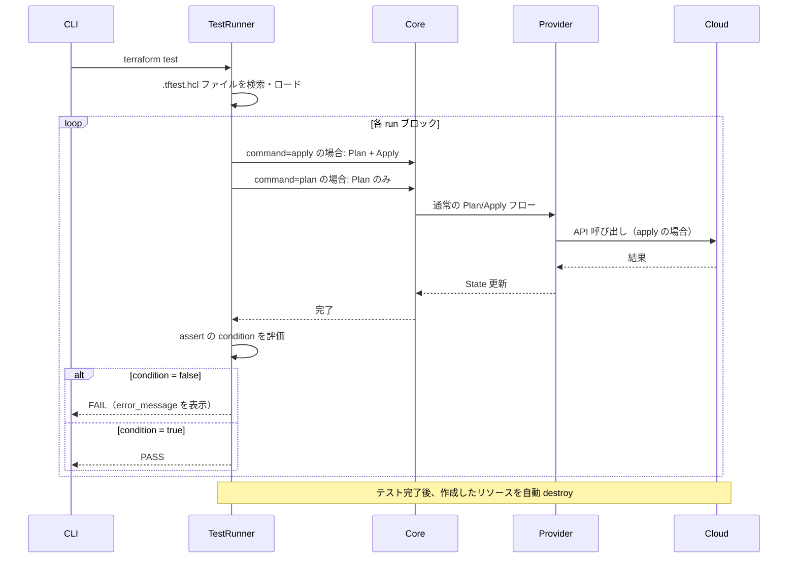
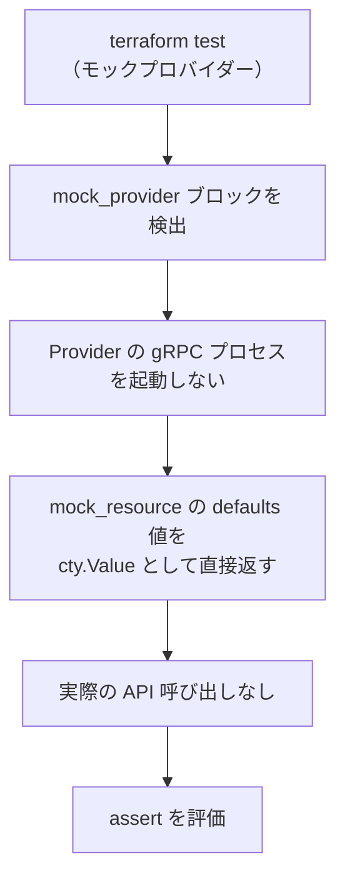

# terraform test（1.6+ テストフレームワーク）

## なぜ terraform test が必要なのか？

従来、Terraform モジュールのテストは `terratest`（Go ライブラリ）や
`kitchen-terraform` などの外部ツールに依存していた。

問題点：
- Go や Ruby の知識が必要でハードルが高い
- 実際にリソースを作成・削除するため時間とコストがかかる
- HCL の中で完結しない

`terraform test` は **HCL だけで書けるネイティブテストフレームワーク** として 1.6 で導入された。

---

## テストファイルの構造

```
my-module/
├── main.tf
├── variables.tf
├── outputs.tf
└── tests/
    ├── basic.tftest.hcl    # テストファイル（.tftest.hcl 拡張子）
    └── advanced.tftest.hcl
```

```hcl
# tests/basic.tftest.hcl

# テスト用の変数上書き
variables {
  instance_type = "t3.micro"
  environment   = "test"
}

# Provider の設定（テスト用に上書き可能）
provider "aws" {
  region = "us-east-1"
}

# run ブロック = 1つのテストケース
run "creates_instance" {
  command = apply  # apply（デフォルト）または plan のみ

  # アサーション
  assert {
    condition     = aws_instance.web.instance_type == "t3.micro"
    error_message = "instance_type が期待値と異なる"
  }

  assert {
    condition     = output.public_ip != null
    error_message = "public_ip が null"
  }
}

run "validates_tags" {
  command = plan  # plan のみ（リソースを作らない）

  assert {
    condition     = aws_instance.web.tags["Environment"] == "test"
    error_message = "Environment タグが設定されていない"
  }
}
```

---

## テスト実行フロー



**重要:** `command = apply` の run ブロックは実際にリソースを作成する。
テスト終了後に自動で `destroy` されるが、**コストが発生する**。

---

## モックプロバイダー（1.7+）

実際のクラウドリソースを作成せずにテストできる。

```hcl
# tests/mock.tftest.hcl

mock_provider "aws" {
  mock_resource "aws_instance" {
    defaults = {
      id         = "i-mock-12345"
      public_ip  = "1.2.3.4"
      private_ip = "10.0.0.1"
    }
  }

  mock_data "aws_ami" {
    defaults = {
      id   = "ami-mock-12345"
      name = "mock-ami"
    }
  }
}

run "with_mock" {
  command = apply  # モックなので実際の API は呼ばれない

  assert {
    condition     = aws_instance.web.public_ip == "1.2.3.4"
    error_message = "public_ip が期待値と異なる"
  }
}
```



**なぜモックが重要か:**
- クラウドの認証情報なしでテストできる（CI コストゼロ）
- テスト実行が数秒で完了する
- ユニットテストとして PR ごとに実行できる

---

## run ブロックの状態共有

```hcl
run "setup" {
  command = apply

  # このブロックで作成したリソースは次の run でも参照できる
}

run "verify" {
  command = plan

  # setup で作成した State を参照可能
  assert {
    condition     = aws_instance.web.id != null
    error_message = "setup で作成したインスタンスが見つからない"
  }
}
```

各 `run` ブロックは前のブロックの State を引き継ぐ。
最後の `run` 完了後に全リソースが `destroy` される。

---

## Go の実装

```go
// internal/command/test.go
type TestCommand struct {
    Meta
}

// テストの実行ロジック
// internal/moduletest/
//   run.go         — run ブロックの実行
//   suite.go       — テストスイート（ファイル単位）
//   assertion.go   — assert の評価
//   mock_provider.go — モックプロバイダーの実装
```

---

## 運用・障害の観点

| シナリオ | 症状 | 対処 |
|---------|------|------|
| テストが途中で失敗してリソースが残る | destroy が走らずコストが発生 | `terraform test -destroy` で強制 destroy。または手動でリソース削除 |
| モックとの差分が本番で発覚 | モックテストは通るが本番で失敗 | 重要なリソースは `command = apply` で実リソーステストも追加する |
| テストが遅い | apply/destroy に数分かかる | モックプロバイダーに切り替えてユニットテスト化する |
| 並列テストの競合 | リソース名が重複する | `run_id` 等をリソース名に含めてユニーク化する |

> **監視指標**: CI での `terraform test` 実行時間をトラッキングする。`command = apply` のテストが増えるとコストと時間が増大する。モックで代替できるテストは積極的にモック化する。

---

## 関連パッケージ

| パッケージ | 内容 |
|-----------|------|
| `internal/command/test.go` | `terraform test` コマンド実装 |
| `internal/moduletest` | テストスイート・run ブロック・アサーションの実行 |
| `internal/providers/mock` | モックプロバイダーの実装 |
